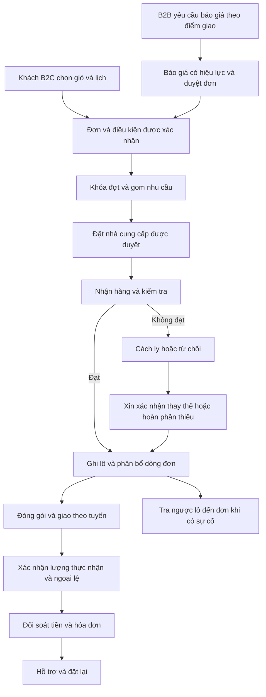
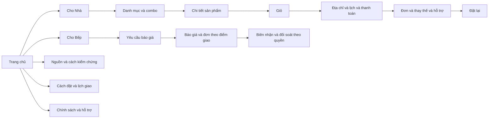
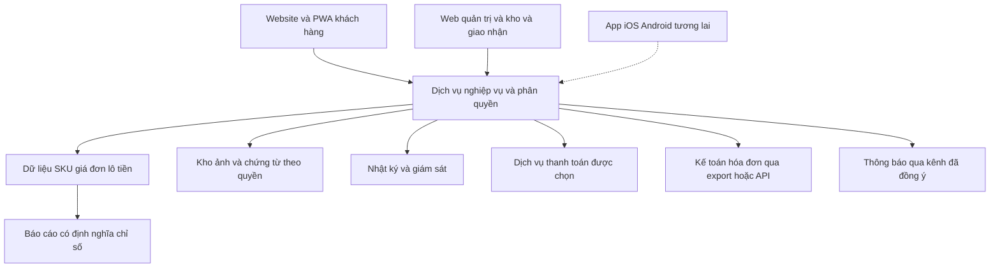

# Kế hoạch triển khai Đủ Lành

**Thương hiệu · Website · App · Quy trình vận hành**  
Phiên bản 1.0, ngày 02/10/2026. Trạng thái: đề xuất để chủ dự án chốt phạm vi và giao việc. Các khoản ngân sách, thời hạn và chính sách mới trong tài liệu chưa phải quyết định đã phê duyệt.

## 1. Quyết định khuyến nghị

Đủ Lành nên triển khai một hệ thống cung ứng thực phẩm đặt trước: nhận diện giúp khách hiểu và tin, website giúp khách đặt đúng nhu cầu và lịch, app giúp mua lại và thao tác nội bộ, dữ liệu giúp doanh nghiệp thực hiện cam kết. Nền tảng hiện có đủ để bắt đầu chuẩn hóa và thiết kế; chưa đủ bằng chứng để mở bán với danh mục, giá và cam kết truy xuất hiện tại.

**Phương án khuyến nghị là phương án B: một thương hiệu, website ưu tiên điện thoại, app dạng web có thể thêm vào màn hình chính (PWA), cùng một hệ thống quản trị đơn hàng và nguồn hàng.** B2B có luồng báo giá và nhiều điểm giao; duyệt đơn và đối soát có thể làm thủ công có nhật ký trong pilot. Chưa đầu tư app iOS/Android riêng trước khi đo được lợi ích kinh tế và nhu cầu thiết bị.

| Quyết định | Đề xuất | Điều kiện và người chốt |
|---|---|---|
| Thương hiệu | Đủ Lành; “Cho Nhà” và “Cho Bếp” là hai cách sử dụng dưới cùng thương hiệu | Chủ dự án chốt brief; tra cứu tên trước sản xuất lớn |
| Định vị | Thực phẩm đặt trước, thông tin nguồn rõ, giá hợp lý, giao theo lịch xác nhận | Vận hành cung cấp bằng chứng cho từng cam kết |
| Pilot | Một cụm dân cư; bắt đầu 30 SKU và 4 combo; tăng tối đa 50 SKU/6 combo khi xử lý ổn định | Vận hành xác nhận nguồn, kho, tuyến và sức chứa |
| Khách hàng | Gia đình mua theo tuần; nhà hàng nhỏ/bếp văn phòng; khoảng 100 B2C và 5–10 B2B là mục tiêu cuối pilot | Tuyển theo đợt, không nhận toàn bộ ngay ngày đầu |
| Website/app | Website giao dịch + PWA khách hàng + web quản trị/kho/giao nhận theo quyền | Demo một đơn từ đặt đến đối soát trước khi ký phạm vi công nghệ |
| Lịch | 12 tuần chuẩn bị/xây dựng; sau đó pilot 8–12 tuần | Dùng tuần tương đối; ngày bắt đầu và ra mắt chưa chốt |
| Thương hiệu | 50 triệu đồng theo đề án | Mốc tham chiếu; chưa xác nhận đã duyệt hoặc đã chi |
| Phương án B, 12 tháng | Quỹ thương hiệu và sản phẩm số 236,5–352,0 triệu đồng | Ước tính lập kế hoạch; chưa gồm vốn vận hành, các quỹ riêng và phí theo lượng dùng; chi tiết mục 9 |
| App iOS/Android | Đánh giá ở tháng 7; chỉ giải ngân nếu có lợi ích định lượng và đội duy trì | Điều kiện tại mục 6; chưa gộp chi phí app native vào phương án B |

### 1.1. Quy ước độ chắc chắn

**Dữ kiện** là thông tin kiểm tra trong chứng từ. **Đề án** là mục tiêu/đề xuất trong tài liệu tháng 9/2026. **Suy luận** là yêu cầu rút ra từ dữ liệu nghiệp vụ. **Giả định** là lựa chọn để lập kế hoạch khi còn thiếu thông tin. **Chờ quyết định** là việc chủ dự án phải chốt. Trừ nội dung gắn nguồn dữ kiện/đề án, mọi yêu cầu thiết kế, ngưỡng mới, công sức và chi phí dưới đây là **đề xuất lập kế hoạch**.

### 1.2. Giả định để lập bản kế hoạch này

| Mã | Giả định | Việc thay đổi nếu khác thực tế |
|---|---|---|
| A1 | Pilot tại một cụm dân cư thuộc TP.HCM; địa chỉ pháp nhân ở Thủ Đức không tự quyết định khu vực giao | Tính lại tuyến, ngày giao, phí, kho và truyền thông theo địa bàn thật |
| A2 | Chủ dự án dành 4–6 giờ/tuần, một người điều phối dành 12–20 giờ/tuần trong chuẩn bị | Thiếu thời gian duyệt làm kéo dài đường găng |
| A3 | Đội công nghệ có hai người phát triển, QA bán thời gian; vận hành có người chịu trách nhiệm trực tiếp | Đội một người cần giảm phạm vi hoặc kéo dài 4–6 tuần |
| A4 | Hai đợt giao/tuần; chưa có giao tức thì | Thay đổi lịch làm thay đổi thiết kế gom đơn, giá và năng lực giao |
| A5 | Kho và phương án bảo quản/giao thực phẩm được chọn riêng; không giả định trụ sở là kho đủ điều kiện | Chưa hoàn tất kho/bảo quản thì chưa mở giao dịch thực |
| A6 | Danh mục nội bộ tham chiếu được phép phân tích; quyền dùng công khai chứng từ/tên đối tác chưa xác nhận | Nội dung công khai chỉ dùng bằng chứng đã được phép |
| A7 | Có thể mua dịch vụ kế toán, thanh toán và thông báo; chưa chọn nhà cung cấp | Đánh giá ở tuần 3, không thiết kế phụ thuộc một dịch vụ chưa thử |

## 2. Kiểm kê nguồn và đánh giá hiện trạng

Tất cả đường dẫn trong bảng dưới đây tương đối với `D:\VDX\Đủ Lành`. [Danh mục tệp chi tiết](</D:/VDX/Đủ Lành/07_Ke_hoach_trien_khai/Danh_muc_nguon_va_gioi_han_doc.md>) phân biệt tệp nguồn, tệp dẫn xuất, hình/render và cấu hình.

| Mã | Nguồn và vị trí | Kỳ/loại | Kết quả kiểm tra | Sử dụng và giới hạn |
|---|---|---|---|---|
| S1 | `01_Ho_so_phap_ly/Giay_chung_nhan_dang_ky_doanh_nghiep_Cong_ty_TNHH_Thuc_pham_Trong_Nha.pdf`, trang 1 | PDF gốc, 2026 | Đối chiếu hình: Công ty TNHH Thực phẩm **Trong Nhã**, MST 0319488896, đăng ký 08/04/2026 | Chuẩn pháp nhân; không công bố dữ liệu định danh cá nhân |
| S2 | `01_Ho_so_phap_ly/Ban_so_hoa_Giay_chung_nhan_dang_ky_doanh_nghiep_Trong_Nha.docx`, bảng thông tin | Word dẫn xuất | Ghi “Trong Nhà”, khác S1 | Đưa vào hàng đợi sửa bản số hóa; không sửa hồ sơ nguồn trong nhiệm vụ này |
| S3 | `02_Mua_hang_Nha_cung_cap/Bang_bao_gia_thuc_pham_Quang_Phu_01-09_den_15-09.xlsx`, sheet `01.09-15.09` | Excel nguồn, kỳ ngày 01/09–15/09, năm chưa xác lập chắc từ tên | Đọc cấu trúc và giá; danh mục rộng, song ngữ, nhiều đơn vị | Tham chiếu danh mục; cần báo giá hiện hành và quyền sử dụng |
| S4 | `02_Mua_hang_Nha_cung_cap/Anh_nguon`, 15 JPG | Ảnh nguồn, 2024/2025 và bảng chưa đủ kỳ | Xem tổng thể ảnh và đối chiếu bản số hóa; có sửa tay/bản 1–2, thiếu trang | Không coi toàn bộ ô nhỏ đã OCR và kiểm chứng |
| S5 | `03_Kho_van_Truy_xuat/Anh_nguon`, 7 JPG; Word cùng thư mục | Ảnh gốc/Word dẫn xuất, 08–09/2024 | Có bản sao phiếu 1.090 kg; đối chiếu cấu trúc với dữ liệu | Bài học mã chứng từ, mã lô và chống đếm trùng; không phải sản lượng Đủ Lành |
| S6 | `04_Du_lieu_so_hoa/Du_lieu_bang_bieu_tong_hop_Worldon.xlsx`, đủ 8 sheet | Excel dẫn xuất nhiều kỳ | Các kết quả cụ thể tại mục 2.1 | Dùng thiết kế dữ liệu/import; chưa làm sổ thanh toán được xác nhận |
| S7 | `05_Bao_cao_Tong_hop/Danh_muc_phan_loai_va_tom_tat_ho_so_Worldon_A4.docx` | Danh mục dẫn xuất | Có tình trạng thiếu ảnh, bản sao và nguyên tắc quản lý | Tái sử dụng mã PL/MH/KV và liên kết hồ sơ |
| S8 | `06_So_do_quan_he_thuong_mai/generate_site.py` và `dist/index.html` | Mã nguồn/trang dẫn xuất | Trang tra cứu tĩnh, lọc, tìm kiếm, phân trang; dữ liệu được nhúng vào trang | Mẫu cho tra cứu nội bộ; không phải hệ giao dịch có bảo mật/tài khoản |
| S9 | `06_So_do_quan_he_thuong_mai/.openai/hosting.json` | Cấu hình hiện có | Cấu hình xuất bản thư mục tĩnh `dist` | Chỉ xác nhận cấu hình; chưa xác minh tình trạng triển khai, quyền và giới hạn hosting |
| S10 | `brand_strategy_docx/Đề án_Đủ Lành_300926.pdf`, 35 trang | Đề án 09/2026 | Trang 2, 4–5, 11–13, 18–20, 22–25, 29: mô hình, pilot, thương hiệu, ngân sách, KPI | Nguồn mục tiêu/giả định chiến lược; không phải bằng chứng thực hiện |
| S11 | Word đề án, PDF/render_v1, render_v2, 70 ảnh trang, 11 hình assets | Bản dẫn xuất | Cùng hệ đề án; khác tệp/phiên bản, không tính là nguồn độc lập | Dùng tham khảo; chưa kiểm tra lại bố cục từng trang bản render |
| S12 | `brand_strategy_docx/build_brand_strategy.py`, `make_diagrams.py`, `export_word_pdf.ps1`, `a11y_report.json` | Công cụ/báo cáo dẫn xuất | Một số đường dẫn trong script xuất PDF/báo cáo còn trỏ `D:\VDX\Worldon` | Tận dụng quy trình tạo tài liệu sau khi sửa tham số; báo cáo cũ không nghiệm thu sản phẩm mới |
| S13 | `CN QUẢNG PHÚ - EOC 28.09.xlsx`, sheet `SỔ CHI TIẾT BÁN HÀNG` | Excel nghiệp vụ 28/09/2026 | 112 dòng, 68 mã, 5 diễn giải điểm giao; kiểm tra phép tính khớp tổng | Tham chiếu nhiều điểm giao/thuế/đối soát; không suy ra doanh thu Đủ Lành |

### 2.1. Kết quả kiểm tra dữ liệu có thể hành động

| Kiểm tra | Kết quả | Vị trí nguồn | Hành động trước mở bán |
|---|---|---|---|
| Dòng báo giá và mã | 469 dòng, 466 mã không trống khác nhau, 3 mã xuất hiện hai lần | S6 `Bao gia!A6:H474` | Không dùng số dòng làm số SKU đã duyệt |
| Giá | 225 dòng giá dương; 244 dòng giá 0 | S6 `Bao gia!G6:G474` | Giá 0 vào trạng thái “chưa xác nhận giá”, không cho thanh toán |
| Mã cần xử lý | `cantau`, `calocnhols3-4`, `dautuongan25` lặp; dầu Tường An có mô tả 25kg/25L | S6 `Bao gia`, mã ở cột B; dầu ở hàng 340/430 | Đối chiếu nguồn; 25kg và 25L không tự quy đổi hoặc gộp |
| Đơn vị | Có Kg/kg/KG, Chai/CHAI, Bịch/bịch/BỊCH/Bich và nhiều dạng bao gói | S6 `Bao gia!F6:F474` | Chuẩn hóa cách viết; chỉ quy đổi khi có quy cách được xác nhận |
| Đơn năm 2025 | 48 dòng đã số hóa; một số ghi tay, ảnh hàng 39–60 chưa được nhập đầy đủ | S6 `Don hang 2025!A6:I53`, `Danh muc anh!A8:E8` | Giữ trạng thái chưa đủ; không suy ra toàn bộ đơn |
| Đơn T11/2024 | 26 dòng đã số hóa; thiếu ảnh Worldon hàng 16–60 | S6 `Don hang T11 2024!A6:I31` và ghi chú đầu sheet | Không ước lượng phần thiếu |
| Theo dõi “151 hàng” | 136 dòng, STT 16–151; thiếu 1–15 | S6 `Theo doi 151 hang!A6:I141` | Tên sheet không có nghĩa 151 dòng đầy đủ |
| Phiếu xuất | 8 dòng sản phẩm gồm bản sao; giữ 7 dòng từ 6 mã phiếu, tổng 1.880 kg | S6 `Phieu xuat kho!A6:J13` | Định danh phiếu và dòng hàng riêng, liên kết bản sao |
| Tiền hàng trang 02 | Dữ liệu nhận dạng cấu trúc, chưa xác nhận số lượng/thành tiền từng ô | S6 `Tien hang T02!A6:E10` | Không đưa vào công nợ hoặc tổng tài chính |
| Sổ EOC | Tiền trước thuế 15.424.600; thuế 87.440; thanh toán 15.512.040 đồng | S13 `I5:K116`, `I117:K117` | Dùng ca nghiệm thu tính tiền/đối soát |
| Tổng số lượng EOC | 2.128,5 là tổng nhiều đơn vị khác nhau | S13 `F5:G116`, `G117` | Không hiển thị thành tổng kg |

Từng dòng EOC được kiểm tra `số lượng × đơn giá = doanh số`, `doanh số + thuế = thanh toán`; không phát hiện sai lệch với dung sai 0,01 đồng trên 112 dòng. Đây là kiểm tra số học, không xác nhận đơn đã giao, tiền đã thu, đúng thuế pháp lý hay quan hệ thương mại với Đủ Lành.

### 2.2. Mức sẵn sàng

| Hạng mục | Hiện trạng | Đầu ra còn thiếu | Chủ sở hữu |
|---|---|---|---|
| Nền tảng thương hiệu | Có đề án và hướng thiết kế | Brief được duyệt, kết quả tra cứu tên, thử khách hàng | Brand + chủ dự án |
| Danh mục/giá | Có dữ liệu tham chiếu | 30 SKU thực bán, giá mua/bán/thuế có hiệu lực, quy cách | Mua hàng + tài chính |
| Nguồn và chất lượng | Có chứng từ lịch sử tham chiếu | NCC pilot đã duyệt, hồ sơ đúng sản phẩm, tiêu chuẩn nhận/bảo quản | Vận hành + QA thực phẩm |
| Công nghệ | Có trang tra cứu tĩnh | Hệ giao dịch, quyền truy cập, nhật ký, đối soát, sao lưu | Product + công nghệ |
| Kinh tế đơn | Chưa có dữ liệu Đủ Lành đủ tính | Chi phí xử lý/giao/hư hao, giá, điều kiện công nợ | Tài chính + vận hành |
| Ra mắt | Chưa xác lập vùng/ngày/năng lực | Kế hoạch tuyển pilot, kho/tuyến, thủ tục áp dụng | Chủ dự án + vận hành |

## 3. Tận dụng kinh nghiệm và tối ưu quy trình

### 3.1. Tài sản giữ, chỉnh sửa, thay thế và hoãn

| Tài sản | Quyết định | Cách dùng | Lợi ích dự kiến và giới hạn |
|---|---|---|---|
| Đề án chiến lược | Giữ và cập nhật | Chuyển thành brief 2–3 trang, quyết định và yêu cầu nghiệm thu | Tránh nghiên cứu lại toàn bộ; chưa đo số giờ tiết kiệm |
| Mã hồ sơ PL/MH/KV | Giữ | Bổ sung ID, phiên bản, người kiểm, ngày hết hiệu lực | Truy ra chứng từ nhanh hơn; thử trên 10 ca |
| Bản số hóa song ngữ | Chỉnh sửa | Giữ nguyên văn, bí danh, từ điển SKU; xác minh tên/đơn vị | Tìm cùng hàng bằng nhiều tên; tiếng Trung nội bộ, website ưu tiên Việt |
| Excel tổng hợp | Giữ bản nguồn, chuyển cấu trúc | Import vào vùng tạm, kiểm tra rồi duyệt dữ liệu chuẩn | Không cho nhiều file cùng trở thành nguồn sửa chính |
| Cách loại `_ban_2` | Thay thế quy tắc | Quan hệ bản sao theo hồ sơ, ảnh/hash và người xác nhận | Hậu tố tệp không đủ chứng minh trùng nghiệp vụ |
| Phân loại từ khóa ở trang tra cứu | Chỉnh sửa | Gán nhóm hàng duyệt thủ công cho SKU chủ lực; từ khóa chỉ gợi ý | Tránh nhầm nhóm từ tên chứa nhiều từ khóa |
| Trang tra cứu tĩnh | Giữ làm mẫu nội bộ | Tái sử dụng ý tưởng lọc/tìm kiếm và giải thích mức bằng chứng | Không tái dùng cơ chế nhúng toàn bộ dữ liệu cho nội dung nhạy cảm |
| Mã tạo đề án/hình | Giữ làm tài sản hỗ trợ | Tham số hóa tên, nguồn, đường dẫn; kiểm tra đầu ra mới | Không chạy ghi đè file đề án trong nhiệm vụ lập kế hoạch |
| Nhãn hàng riêng/nhượng quyền | Hoãn | Giữ cổng đánh giá ở lộ trình 12 tháng | Giảm phạm vi pilot; cần mô hình đơn vị có lợi nhuận |

### 3.2. Bằng chứng → thay đổi → đo hiệu quả

| Bằng chứng có sẵn | Bài học và loại kết luận | Thay đổi quy trình | Hạng mục sản phẩm | Cách đo |
|---|---|---|---|---|
| 3 mã báo giá lặp, 244 giá 0 | Danh mục chưa sẵn mở bán; suy luận | Duyệt SKU và giá riêng trước công bố | D01, D02 | Số SKU lỗi phát hiện trước/sau nhập, tỷ lệ sản phẩm bị chặn đúng |
| 25kg/25L cùng mã | Tên tương tự không đủ gộp; trực tiếp từ dữ liệu | Duyệt quy cách và hệ số quy đổi | D01 | 100% SKU pilot có đơn vị chuẩn; không còn quy đổi đoán |
| Ghi tay và thiếu ảnh | Trích xuất cần xác minh; trực tiếp từ hồ sơ | Vùng tạm, hàng đợi kiểm, người nhập khác người duyệt tiền | D03 | Phút kiểm/dòng, lỗi sửa sau duyệt |
| Bản sao phiếu 1.090 kg | Một nghiệp vụ có nhiều ảnh; trực tiếp | Tách tài liệu, bản sao và giao dịch | D03, O04 | Số giao dịch trùng bị phát hiện, đối chiếu 1.880 kg |
| EOC 5 diễn giải điểm giao | Tổ chức và điểm giao cần tách; suy luận | Mã tổ chức, mã địa điểm, lịch và đối soát riêng | B02, F01 | Phút lập bảng từng điểm; số sai địa điểm |
| Sổ có nhiều đơn vị và thuế theo dòng | Tổng lượng và tổng tiền có quy tắc khác; suy luận | Tổng lượng theo đơn vị; snapshot giá/thuế | O01, F01 | Đối soát khớp; không có tổng kg từ đơn vị hỗn hợp |
| Đề án yêu cầu giao theo lịch | Lịch và khóa đơn là phần cốt lõi; đề án | Chỉ bán lịch còn sức chứa; gom theo đợt | O02 | Đơn sau khóa, quá sức chứa, giao đúng theo lịch gốc |
| Phần mềm phổ biến có thể mua | Mua hay tự xây cần demo thực tế; kinh nghiệm triển khai phổ biến | Thử 8 tình huống ở tuần 3 | T01 | Số yêu cầu đạt, chi phí tùy chỉnh và duy trì |
| Dùng một thư viện giao diện | Giảm lệch giữa các điểm chạm; kinh nghiệm phổ biến | Duyệt token và component trước màn hình đầy đủ | BR03, U01 | Số lỗi không nhất quán, thời gian sửa 1 thay đổi |

Các lợi ích ở bảng là mục tiêu cần đo. Trong hai tuần đầu pilot, ghi thời gian nhập đơn, báo giá, tìm bằng chứng và đối soát; tuần 5–8 đo lại cùng loại ca. Không công bố tỷ lệ tiết kiệm trước khi có đường cơ sở.

## 4. Brief thương hiệu và danh mục bàn giao

### 4.1. Nền tảng đề xuất

**Khách hàng mở thị trường:** gia đình cần chuẩn bị bữa ăn theo tuần tại một khu vực có thể gom tuyến; B2B là nhà hàng nhỏ/bếp văn phòng có lịch cung ứng rõ và người quyết định tiếp cận được. Trường tư là nhóm thử tiếp theo; bệnh viện/đơn vị công cần năng lực hồ sơ và phục vụ đã chứng minh. Đây là thứ tự theo S10 trang 9.

**Định vị:** Đủ Lành là dịch vụ cung ứng thực phẩm theo kế hoạch cho gia đình và bếp ăn, giúp người mua chọn đúng nhu cầu, biết thông tin nguồn và nhận hàng theo lịch đã xác nhận. Lợi thế đặt trước chỉ trở thành lợi ích thật khi giảm hao hụt, tạo tuyến đủ mật độ và duy trì chất lượng.

**Kiến trúc:** Đủ Lành là tên thương mại làm việc; Công ty TNHH Thực phẩm Trong Nhã xuất hiện ở thông tin pháp nhân, hóa đơn, điều khoản và hồ sơ B2B. “Cho Nhà”/“Cho Bếp” dùng như tên khu vực nội dung, không tạo hai logo độc lập. Dòng “Một thương hiệu của Trong Nhã” chỉ dùng sau khi chủ dự án xác nhận cách thể hiện.

| Trụ cột | Người mua nhận gì | Bằng chứng tối thiểu trước công bố | Người giữ bằng chứng |
|---|---|---|---|
| Thông tin nguồn rõ | Biết đơn vị cung ứng, xuất xứ đã xác minh và lô giao khi có | Hồ sơ SKU, NCC, chứng từ/lô và phạm vi dữ liệu | QA + mua hàng |
| Giá hợp lý | Thấy giá theo đúng đơn vị, phí và tổng thực trả | Giá có hiệu lực, quy cách, phí, phương pháp so sánh nếu dùng | Tài chính |
| Đúng nhu cầu | Combo và giỏ theo lượng cần, chọn lịch, biết thay thế | Danh mục, lịch/sức chứa, sự đồng ý thay thế | Vận hành + CSKH |
| Có trách nhiệm | Có đầu mối xử lý hàng lỗi/giao thiếu | Chính sách, ticket, nhật ký xử lý/hoàn tiền | CSKH |

### 4.2. Ba hướng sáng tạo và lựa chọn

| Hướng | Ý tưởng triển khai | Ưu điểm | Rủi ro cần thử | Quyết định |
|---|---|---|---|---|
| Dấu Nguồn Lành | Wordmark rõ, đường nối mềm, ô thông tin nguồn/lịch; dấu là cấu trúc đồ họa | Phù hợp gia đình và tài liệu bếp; dễ lên tem và giao diện | Tránh hình thức tem chứng nhận/huy chương chính thức | **Khuyến nghị**, kế thừa đề án |
| Bếp Đủ Đầy | Giỏ, khay, bố cục ấm và hình bữa ăn | Gợi nhu cầu hằng tuần rõ | Có thể bị hiểu là đồ ăn chế biến sẵn, yếu hơn B2B | Phương án đối chiếu trong test |
| Nối Từ Nguồn | Tuyến nối, các điểm dữ liệu, bố cục kỷ luật | Hợp tác vụ B2B và hệ thống | Dễ lạnh, khó gần với người mua gia đình | Tham chiếu cho giao diện quản trị |

Tuần 4 cho người mua xem cùng ngữ cảnh trang sản phẩm, tem và báo giá. Chấm: hiểu ngành/mô hình 25%, rõ thông tin và tin cậy 25%, nhận diện ở kích thước nhỏ 20%, phù hợp B2C/B2B 15%, triển khai nhất quán 15%. Đây là thang duyệt nội bộ, không phải điểm thị trường. Chủ dự án chọn một hướng; phản hồi test dùng để sửa, không quyết định bằng số lượt “thích” đơn thuần.

### 4.3. Quy chuẩn thiết kế để giao việc

- Wordmark “Đủ Lành” phải rõ dấu tiếng Việt. Cách viết “Du Lanh” chỉ dùng trong URL/tìm kiếm/bối cảnh kỹ thuật cần không dấu; không thay dấu trong bản logo chính.
- Bàn giao ba khóa logo: ngang, xếp tầng, biểu tượng; có bản một màu, âm bản, kích thước tối thiểu và khoảng trống. Biểu tượng dùng cho favicon/PWA/app tương lai, không ép toàn bộ tên vào icon nhỏ.
- Màu kế thừa: #1F6B48 là màu chủ; #6F9E75 hỗ trợ; #F5F0E3 nền; #D4A73C nhấn; #202326 chữ. Màu hỗ trợ/vàng chưa được dùng làm chữ nhỏ trước khi đo tương phản. CMYK cần nhà in proof theo vật liệu, không coi mã RGB là cam kết màu in.
- Font ưu tiên thử Be Vietnam Pro; Noto Sans là phương án thay thế. Brand lưu license đúng bản font sẽ bàn giao, kiểm tra chữ có dấu và webfont trước duyệt. Chưa xác nhận license của tệp font cụ thể trong thư mục hiện tại.
- Icon dùng cùng độ dày và lưới, ưu tiên nguồn, lịch, bảo quản, khối lượng, thay thế, đổi trả. Trạng thái có chữ giải thích bên cạnh, không phân biệt chỉ bằng màu.
- Ảnh thể hiện sản phẩm, đóng gói, người làm và giao nhận thực tế đã có quyền dùng. Ảnh minh họa/AI cần nhận diện đúng vai trò, không dùng làm bằng chứng trang trại hoặc chứng nhận.
- Thông điệp “Rõ nguồn, giá vừa” và ý tưởng “Đủ lành cho mỗi ngày” kế thừa S10 trang 18; thử hiểu nghĩa và đối chiếu khả năng chứng minh trước công bố. “Lành” không diễn đạt tác dụng y tế.
- Mẫu giọng văn: “Chốt đơn lúc [giờ/ngày]. Giao trong [khung giờ]. Nếu thiếu hàng, chúng tôi xin xác nhận trước khi thay.” Các phần trong ngoặc là dữ liệu cấu hình, chưa phải lịch chính thức.

Chọn mục tiêu thiết kế WCAG 2.2 AA: chữ thường tương phản tối thiểu 4,5:1; chữ lớn 3:1 theo định nghĩa chuẩn. Với nút chính, mục tiêu nội bộ là vùng bấm 44×44 CSS px; tiêu chí WCAG 2.2 AA về kích thước mục tiêu là 24×24 hoặc điều kiện ngoại lệ/khoảng cách tương ứng, không được đồng nhất hai mức này. [W3C về tương phản](https://www.w3.org/WAI/WCAG22/Understanding/contrast-minimum.html), [W3C về kích thước mục tiêu](https://www.w3.org/WAI/WCAG22/Understanding/target-size-minimum).

### 4.4. Danh mục tài sản và nghiệm thu

| Mã | Đầu ra và số lượng đề xuất | Ưu tiên/mốc | Phụ trách → duyệt | Tiêu chí nghiệm thu |
|---|---|---|---|---|
| BR01 | Brief chiến lược 2–3 trang, thông điệp và sổ claim | Trước thiết kế, W2 | Brand → chủ dự án/QA | Mỗi lời hứa có bằng chứng hoặc nhãn chưa dùng |
| BR02 | 3 hướng thử, chọn 1; 3 khóa logo × các bản màu/một màu | W4–5 | Brand → chủ dự án | Đọc đúng dấu, không bị hiểu là chứng nhận; test ứng dụng |
| BR03 | Bộ màu/font, 12 icon, 2 pattern; token giao diện | W5 | Brand + UX → Product | Quy tắc sử dụng, license, tương phản và token thống nhất |
| BR04 | 2 mẫu tem: đơn vị đóng gói và thùng; bố trí QR/mã lô | W5–6 | Brand + QA → vận hành | Proof tem 30/40 mm, máy in thật, quét được mẫu đã in |
| BR05 | 1 mẫu thùng một màu, 1 mẫu túi/đai; bản artwork | W6 | Brand → vận hành | Chữ/biểu tượng rõ trên vật liệu thử, không thiếu trường bắt buộc |
| BR06 | Báo giá, phiếu giao, đối soát, hồ sơ B2B 6–8 trang | W6 | Brand + kế toán → chủ dự án | Nhiều đơn vị và điểm giao, photocopy đọc được; nội dung không dùng thành tích chưa xác minh |
| BR07 | 6 mẫu social, ảnh đại diện/bìa, chữ ký email | W6 | Brand → chủ dự án | Dùng lại dễ; trường nội dung/claim có hướng dẫn |
| BR08 | Art direction và 15–20 ảnh lựa chọn ban đầu | W6–8 | Brand + vận hành → QA/chủ dự án | Có quyền sử dụng, liên hệ sản phẩm thật; phạm vi chụp theo báo giá |
| BR09 | Guideline 20–30 trang và bộ tệp gốc | W8 | Brand → Product/chủ dự án | Hướng dẫn đủ để người khác tạo tem/social/quote nhất quán |
| U01 | Thư viện UI; 5 khung đại diện trong gói ứng dụng thương hiệu | W5–6 | UX + Brand → Product | Trang chủ, sản phẩm, giỏ, đơn, báo giá chung token; không tính trùng phí UX |

Gói thương hiệu chỉ bao gồm định hướng và năm khung đại diện; user flow, các màn hình còn lại, prototype và trạng thái chi tiết thuộc gói UX sản phẩm số. Hai đối tác phải dùng một thư viện và một danh mục bàn giao để tránh trả phí hai lần.

Bàn giao: SVG/PDF vector, PNG phù hợp, tệp gốc chỉnh sửa, cấu trúc layer, RGB/CMYK đã proof, font/license, ảnh/license, tài liệu và phiên bản thư viện UI. Đợt duyệt mặc định gồm chọn hướng, tinh chỉnh và duyệt trước sản xuất; thay đổi định vị sau khi chọn hướng phải đánh giá lại chi phí/thời gian.

## 5. Thiết kế dịch vụ và quy trình

### 5.1. Hiện trạng có thể xác nhận và luồng đề xuất

Hồ sơ hiện có phản ánh các phần rời: báo giá → ảnh đơn/bảng theo dõi; phiếu xuất → đơn vị nhận; sổ bán hàng → tổng theo diễn giải địa điểm. Chưa có bằng chứng về một luồng vận hành Đủ Lành đang hoạt động từ nhận đơn đến thu tiền. Vì vậy, sơ đồ sau là thiết kế đề xuất, không mô tả quy trình hiện hữu đã chứng minh.

### 5.2. Quy trình chuẩn tối thiểu

W là tuần chuẩn bị; D là ngày giao. Thời điểm D−1 dưới đây là giả định để diễn tập, không phải cam kết công khai.

| Bước | Người làm | Dữ liệu vào → ra | Công cụ/thời hạn đề xuất | Kiểm soát, ngoại lệ và bằng chứng |
|---|---|---|---|---|
| 1. Duyệt nguồn | Mua hàng + QA | Hồ sơ NCC/SKU → danh sách được duyệt | Kho hồ sơ; trước đưa SKU lên bán | Thiếu hồ sơ thì treo SKU; người duyệt, phạm vi, ngày rà soát được lưu |
| 2. Duyệt giá | Mua hàng + tài chính | Giá mua/quy cách/chi phí/thuế → giá bán có hiệu lực | Quản trị; trước mỗi đợt | Không dùng giá lịch sử hoặc 0; lưu giá theo thời điểm |
| 3. Mở lịch | Vận hành | Nguồn, nhân lực, xe/kho → đợt giao có sức chứa | Quản trị; theo tuần | Sức chứa theo điểm giao và thời gian xử lý, không chỉ số đơn |
| 4. Nhận B2C | Khách; CSKH hỗ trợ | Giỏ/địa chỉ/lịch/đồng ý → đơn | Website/PWA; trước khóa | Tổng phí, lượng dự kiến, cách thay thế hiển thị; ngoài vùng vào danh sách chờ |
| 5. Nhận B2B | Sales + người mua | Tổ chức/điểm/quy cách/lịch → báo giá và đơn duyệt | Form + quản trị; SLA phản hồi dự kiến 1 ngày làm việc | Hiệu lực giá, công nợ, quyền duyệt và lịch riêng được xác nhận bằng tài liệu |
| 6. Khóa/gom | Điều phối | Đơn hợp lệ → lượng cần theo SKU/NCC/đợt | Quản trị; giả định 16h D−1 | Khóa chỉ phía máy chủ; đơn chưa thanh toán/ngoại lệ xử lý theo chính sách được duyệt |
| 7. Mua hàng | Mua hàng | Tổng nhu cầu − lượng khả dụng được duyệt → đơn mua | Quản trị/xuất đơn; sau khóa | Không mua theo tổng cộng đơn vị hỗn hợp; thiếu nguồn xin thay thế |
| 8. Kiểm nhận | Kho + QA | Hàng/phiếu/tiêu chuẩn → lượng đạt, từ chối, lô | Điện thoại/phiếu; khi nhận | Cân, ảnh, tình trạng, nhiệt độ khi nhóm hàng yêu cầu; hàng không đạt cách ly |
| 9. Phân bổ/đóng gói | Kho | Lô đạt + dòng đơn → kiện và tem | Danh sách picking; trước xuất | Một dòng có thể dùng nhiều lô; lượng phân bổ không vượt lượng đạt |
| 10. Giao | Giao nhận | Kiện/tuyến/lịch → lượng thực nhận và biên nhận | Web giao nhận/phiếu dự phòng | Mất mạng ghi bằng chứng dự phòng; trạng thái chưa đồng bộ không là giao xong |
| 11. Đối soát | Kế toán + CSKH | Lượng, tiền, biên nhận → số phải thu/hoàn/hóa đơn | Quản trị + phần mềm kế toán; chốt sau mỗi đợt | Người lập khác người duyệt hoàn; công nợ không được xóa bằng sửa đơn |
| 12. Hỗ trợ/mua lại | CSKH | Đơn/ticket → xử lý, giỏ đặt lại | Quản trị; theo SLA nhóm sự cố | Đặt lại tạo đơn mới với giá/lịch mới; lưu nguyên nhân và kết quả |
| 13. Thu hồi | QA + vận hành | Lô nghi vấn → danh sách đơn/người bị ảnh hưởng | Tra lô và diễn tập | Khóa bán/phân bổ, lưu bằng chứng, chủ dự án duyệt truyền thông; không xóa lịch sử |

### 5.3. Chính sách cần chốt và cách xử lý

| Tình huống | Quy tắc đề xuất | Chủ quyết định | Tiêu chí nghiệm thu |
|---|---|---|---|
| Giỏ tối thiểu | Thử 300.000 đồng ở mô hình kinh tế; cấu hình theo vùng/lịch nếu được duyệt | Tài chính + chủ dự án | Thay cấu hình không sửa mã; khách thấy điều kiện trước thanh toán |
| Hàng cân thực tế | Công bố giá/đơn vị, lượng dự kiến và cách quyết toán; phạm vi chênh cân do vận hành/khách xác nhận | Vận hành + tài chính | Không tăng tiền ngoài giới hạn đồng ý; trường hợp vượt phải xin lại |
| Hàng đóng gói | Giá theo gói có quy cách cụ thể; không áp dụng logic chênh cân | Mua hàng | Trang hàng và đơn lưu đúng đơn vị/gói |
| Thiếu/thay thế | Khách chọn không thay hoặc xin xác nhận; đề xuất thay phải có SKU/lượng/giá mới | CSKH | Không phản hồi không được coi đồng ý; thiếu thì bỏ/hoàn theo quy tắc |
| Sau giờ khóa | Tắt chọn đợt đã khóa; CSKH tạo ngoại lệ khi nguồn và tuyến cho phép | Điều phối | Ngoại lệ có người duyệt, lý do, tác động; không âm thầm mở lại đợt |
| Hủy sau khóa | Quy tắc theo mức độ chuẩn bị, được công bố và rà soát pháp lý | Chủ dự án + pháp chế | Khách thấy điều kiện; không tự đặt mức phạt trong hệ thống |
| Giao thiếu/trễ | Báo khách, ghi lượng/giờ thực tế, đề xuất bù/hoàn theo chính sách | Vận hành + CSKH | Lịch gốc không bị sửa để làm đẹp KPI; tách lý do khách đổi lịch |
| Hàng lỗi | Ticket gắn đơn/dòng/lô, ưu tiên xử lý chất lượng, khóa lô khi nghiêm trọng | QA | Không yêu cầu bằng chứng không hợp lý làm cản xử lý; có thời hạn từng nhóm |
| Hoàn tiền | Tạo yêu cầu hoàn, tài chính duyệt, lưu giao dịch và thông báo | Tài chính | Một yêu cầu không hoàn hai lần; không gắn “đã hoàn” khi chỉ mới duyệt |
| Công nợ B2B | Hạn mức, ngày đến hạn và người duyệt; khách mới mặc định chưa cấp tín dụng | Tài chính + chủ dự án | Vượt hạn mức/quá hạn bị cảnh báo/chặn theo chính sách; ngoại lệ có nhật ký |
| Thu hồi | Cách ly lô, tra khách, liên hệ/thu hồi và điều tra nguyên nhân | QA + chủ dự án | Diễn tập tìm đủ đơn trong 15 phút là mục tiêu nội bộ, không tuyên bố đã đạt |

SLA hỗ trợ cần tách tiếp nhận, điều tra và hoàn tất. Đề xuất tiếp nhận vấn đề chất lượng nghiêm trọng trong giờ trực trong 30 phút; các phản ánh khác trong 4 giờ làm việc. Trước mở bán phải công bố giờ trực, người dự phòng và SLA đã được đội vận hành xác nhận; không dùng các mốc này làm cam kết 24/7 mặc định.

## 6. Website, app và danh sách màn hình

### 6.1. Sitemap và hành trình

B2C: hiểu lịch → kiểm tra vùng giao → chọn nhu cầu → xem nguồn/giá/đơn vị → xác nhận đơn → xác nhận thay thế nếu có → nhận hàng → đặt lại. B2B: gửi nhu cầu và điểm giao → duyệt hồ sơ/báo giá → chốt lịch/quy cách/công nợ → nhận từng điểm → đối soát. Link QR lô đi trực tiếp tới trang bằng chứng công khai phù hợp; không bắt đăng nhập để xem thông tin nguồn được công bố.

### 6.2. Quy ước trạng thái dùng cho mọi màn hình

Mọi màn hình có dữ liệu phải thiết kế đủ: đang tải; trống có hướng dẫn; lỗi có cách thử lại; thiếu quyền; mạng yếu/offline; thành công; dữ liệu hết hiệu lực hoặc trạng thái đã đổi. Không giữ nút mua khi giá/lịch chưa được xác nhận. Lỗi nhập liệu ghi tại trường và giữ dữ liệu đã nhập. Dữ liệu khách/tài chính không được cache vào vùng dùng chung công khai. Một màn hình có thể gồm nhiều trạng thái, không tính mỗi trạng thái thành “trang” để tính giá thiếu minh bạch.

Trong bảng dưới, “P0” là cần trước pilot; “P1” trong pilot; “P2” sau pilot. Product chịu trách nhiệm phạm vi/nghiệm thu nghiệp vụ, UX thiết kế, công nghệ thực hiện; người nghiệp vụ được ghi ở cột cuối.

| Mã/màn hình | Việc người dùng/CTA | Trường và bằng chứng | Ngoại lệ riêng; nghiệm thu | Giai đoạn/người nghiệp vụ |
|---|---|---|---|---|
| W01 Trang chủ | Hiểu mô hình, chọn Cho Nhà/Cho Bếp | Mô hình, vùng, lịch, lợi ích có bằng chứng | Không dùng số khách/đối tác giả; CTA đưa tới đúng luồng | P0/Brand |
| W02 Vùng/lịch | Kiểm địa chỉ, chọn đợt | Vùng, ngày/khung giờ, giờ khóa, phí | Ngoài vùng cho đăng ký chờ; không đặt vào đợt đóng | P0/vận hành |
| W03 Danh mục/tìm | Tìm hàng và thêm giỏ | Tên/bí danh, nhóm, quy cách, giá/đơn vị | Giá chưa duyệt/hết đợt không cho mua; tìm tiếng Việt có/không dấu | P0/mua hàng |
| W04 Combo | Chọn giỏ tuần | SKU, lượng, số người tham khảo, tổng giá | Thành phần đổi cần giá/đồng ý mới; không ghi tư vấn dinh dưỡng chưa có cơ sở | P0/vận hành |
| W05 Sản phẩm | Xem và chọn lượng | Ảnh, quy cách, xuất xứ xác minh, bảo quản, mức bằng chứng, giá | Không có lô trước nhận thì nêu rõ; không tạo QR lô giả | P0/QA |
| W06 Giỏ | Kiểm lượng/giá/đơn tối thiểu | Dòng hàng, phí, tổng dự kiến, chênh cân/thay thế | Giá đổi phải báo trước; kg và gói hiển thị riêng | P0/tài chính |
| W07 Checkout | Xác nhận địa chỉ/lịch/điều kiện | Liên hệ tối thiểu, địa chỉ, lựa chọn thay thế, phương thức tiền | Hết sức chứa khi xác nhận thì đề nghị lịch khác; không mất giỏ | P0/vận hành |
| W08 Thanh toán/kết quả | Trả tiền hoặc biết phải làm gì | Mã đơn, mã giao dịch, số tiền, trạng thái | Chưa rõ kết quả không gọi “thất bại” hay “đã trả”; thử lại không nhân đôi đơn | P0/kế toán |
| W09 Chi tiết đơn | Theo dõi, xác nhận thay, nhận hỗ trợ | Lịch gốc, trạng thái, lượng thực, chứng từ phù hợp | Thay thế có giá rõ; đơn hủy không thể tiếp tục thanh toán | P0/CSKH |
| W10 Đơn cũ/đặt lại | Mua lại giỏ | Dòng cũ, giá mới, lịch mới | Hàng không còn bán được bỏ/xin chọn lại; không copy giá cũ | P1/CSKH |
| W11 Tài khoản/địa chỉ | Quản lý thông tin | Liên hệ, địa chỉ, tùy chọn thông báo | Đổi số/liên hệ cần xác minh; quyền riêng tư có lối tiếp cận | P0/CSKH |
| W12 Nguồn/QR | Kiểm chứng phạm vi công bố | SKU/lô, NCC/xuất xứ được phép, ngày cập nhật | QR không tồn tại/hồ sơ hết hiệu lực có giải thích; không lộ giá mua/PII | P0/QA |
| W13 Cách đặt/chính sách | Biết lịch/đổi trả/hỗ trợ | Chính sách theo phiên bản, pháp nhân, liên hệ | Đơn giữ phiên bản đã chấp nhận; form hỗ trợ có mã theo dõi | P0/pháp chế/CSKH |
| W14 Khiếu nại/hoàn | Gửi và theo dõi yêu cầu | Đơn/dòng, loại lỗi, ảnh tùy trường hợp, phản hồi | Không gửi trùng ticket do nhấn lặp; nêu bước tiếp theo | P0/CSKH |
| B01 Cho Bếp/yêu cầu giá | Mô tả nhu cầu | Tổ chức, điểm giao, SKU/quy cách, lịch, người liên hệ | Thiếu hồ sơ chưa tự chấp thuận NCC; gửi form được cấp mã | P0/sales |
| B02 Tổ chức/điểm giao | Quản lý địa điểm | ID tổ chức, điểm giao, người nhận, lịch | Người điểm A không thấy dữ liệu không được phép của B | P0/điều phối |
| B03 Báo giá | Xem/chấp nhận phiên bản | Giá theo lượng, hiệu lực, thuế, lịch, điều khoản | Giá hết hiệu lực yêu cầu cập nhật; ký/chấp thuận lưu bằng chứng | P0/sales/kế toán |
| B04 Duyệt đơn | Người có thẩm quyền chốt | Người tạo/duyệt, ngân sách/hạn mức | Pilot cho phép xác nhận ngoài hệ thống và nhập có nhật ký; tự động P2 | P0 thủ công/tài chính |
| B05 Đơn/biên nhận | Theo dõi từng điểm | Đặt/giao thực, lô, biên nhận và chênh lệch | Giao một điểm không làm toàn đơn thành hoàn tất | P0/vận hành |
| B06 Đối soát/công nợ | Kiểm số phải trả | Đơn theo kỳ/điểm, hóa đơn, tiền, hạn | Chỉ đúng vai trò kế toán; tranh chấp không tự xóa nợ | P0 xuất file có kiểm soát/kế toán |
| B07 Đơn định kỳ | Lập nhu cầu lặp | Mẫu hàng/lịch/điểm | Lần lặp vẫn phải xác nhận giá/khả dụng; không tự trừ tiền khi chưa có cơ chế đồng ý | P2/sales |

| Mã/màn hình nội bộ | CTA/tác vụ | Dữ liệu chính | Ngoại lệ và nghiệm thu | Giai đoạn/người nghiệp vụ |
|---|---|---|---|---|
| A01 Bảng đợt giao | Xem đơn/ngoại lệ còn mở | Đơn, lịch, lượng, sức chứa | Không cộng nhầm đơn hủy/chưa đủ điều kiện | P0/điều phối |
| A02 SKU/quy cách | Nhập/duyệt | SKU, bí danh, đơn vị, ảnh, hồ sơ | Mã trùng/25kg–25L vào hàng đợi; không ghi đè | P0/mua hàng |
| A03 NCC/bằng chứng | Duyệt nguồn | Chứng từ, hiệu lực, quyền công bố | Hồ sơ hết hạn cảnh báo; chưa duyệt không công bố claim | P0/QA |
| A04 Giá/lịch | Mở bán đợt | Giá mua/bán, thuế, ngày, sức chứa | Cập nhật không sửa đơn đã xác nhận | P0/tài chính/vận hành |
| A05 Gom/mua | Xuất lượng cần | SKU/đơn vị/NCC/đợt | Chỉ quy đổi được duyệt; thiếu nguồn mở ticket | P0/mua hàng |
| A06 Kiểm nhận/lô | Ghi đạt/từ chối | Lượng, lô, hạn, ảnh, nhiệt độ khi cần | Không có mã lô NCC thì có mã tiếp nhận nội bộ và nêu giới hạn truy xuất | P0/kho/QA |
| A07 Picking/tem | Phân lô/in | Dòng đơn, nhiều lô, lượng, mã kiện | Không phân quá tồn đạt; in lại có nhận diện phiên bản | P0/kho |
| A08 Giao nhận | Nhận tuyến/xác nhận | Địa chỉ tối thiểu, kiện, lượng, giờ, ảnh | Offline có trạng thái chờ; người giao chỉ thấy tuyến được giao | P0/giao nhận |
| A09 Tiền/đối soát | Khớp thu/hoàn/nợ | Mã giao dịch, hóa đơn, dòng chênh | Callback/nhập lặp không cộng tiền lần hai | P0/kế toán |
| A10 Ticket/thay/hoàn | Phân công/xử lý | Đơn/dòng/lô, sự đồng ý, hành động | Không sửa nội dung đồng ý của khách; tài chính duyệt hoàn | P0/CSKH |
| A11 Tra lô/thu hồi | Khóa và tìm đơn | Lô, lượng còn, đơn bị ảnh hưởng | Kiểm đủ ca nhiều lô và giao một phần | P0/QA |
| A12 Quyền/nhật ký | Cấp quyền/xem thay đổi | Người dùng, vai trò, thời điểm, trước/sau | Người dùng không tự nâng quyền; lưu hành động nhạy cảm | P0/quản trị |
| A13 Import/xác minh | Nạp/kiểm/duyệt | Tệp, sheet/dòng, lỗi và người duyệt | Tệp mới không tự cập nhật dữ liệu đã bán | P0/data + kế toán |
| A14 KPI | Xem theo đợt/kênh | Chỉ số, mẫu số, kỳ, trạng thái đủ dữ liệu | Dữ liệu thiếu hiện “chưa đủ”, không hiện 0% giả | P1/tài chính/Product |

### 6.3. Nội dung và đo lường website

Trang chủ cần giải thích ba bước: chọn giỏ/lịch → Đủ Lành chuẩn bị theo nhu cầu → nhận hàng và hỗ trợ. Trang sản phẩm ưu tiên tên, quy cách, lượng, giá/đơn vị, ngày giao và thông tin nguồn đã kiểm tra. Cho Bếp ưu tiên hồ sơ mẫu, quy cách, lịch, trách nhiệm giao và nút yêu cầu báo giá. Không dùng logo đối tác tham chiếu hoặc số nghiệp vụ lịch sử để quảng cáo năng lực hiện tại.

SEO giai đoạn đầu: cấu trúc URL dễ hiểu, tiêu đề/mô tả riêng, sitemap, ảnh có mô tả, trang chính sách/pháp nhân; không index tài khoản/giỏ/đơn/hồ sơ nội bộ. Dữ liệu sản phẩm có cấu trúc phải phản ánh giá và khả dụng thực tế. Các sự kiện tối thiểu: xem cách đặt, kiểm vùng, xem nguồn, thêm giỏ, bắt đầu checkout, đơn xác nhận, thanh toán xác nhận, yêu cầu báo giá, đặt lại. Không gửi địa chỉ/số điện thoại vào công cụ phân tích hành vi.

### 6.4. Chọn hình thức app

| Phương án | Đáp ứng | Điểm cần đánh đổi/kiểm thử | Phạm vi dùng |
|---|---|---|---|
| Website đáp ứng | Bán hàng/tra cứu qua link, ưu tiên điện thoại | Ít cảm giác app, thông báo phụ thuộc kênh hỗ trợ | Phương án A và lớp nền của B |
| PWA | Dùng cùng website, thêm màn hình chính; giỏ/đặt lại và tác vụ nội bộ | Cài đặt/quyền push khác thiết bị; không cam kết đồng bộ nền liên tục | **Chọn cho B** |
| App đa nền tảng | App store, trải nghiệm và tính năng thiết bị theo thư viện | Thêm phát hành, kiểm thử hai nền tảng, duy trì tích hợp | Cổng quyết định tháng 7 |
| Hai app native riêng | Tối ưu sâu từng hệ điều hành | Hai luồng phát triển/kiểm thử và chi phí lớn | Chỉ khi có yêu cầu kỹ thuật mà lựa chọn trước không đáp ứng |

Apple hỗ trợ web push cho Home Screen web app trên iOS/iPadOS 16.4 trở lên; cần kiểm tra quyền, điều kiện cài và khả năng trên thiết bị thực. Không dùng push làm kênh duy nhất cho thay hàng hoặc lịch giao. [Tài liệu Apple](https://developer.apple.com/documentation/usernotifications/sending-web-push-notifications-in-web-apps-and-browsers), [WebKit](https://webkit.org/blog/13878/web-push-for-web-apps-on-ios-and-ipados/). Kiểm tra nguồn ngày 02/10/2026; danh sách thiết bị pilot xác lập ở W2, kiểm thử W10–11.

Offline trong MVP: có thể xem dữ liệu không nhạy cảm đã lưu và giữ giỏ nháp; xác nhận đơn, tiền, lô phân bổ và công nợ cần kết nối và máy chủ xác nhận. Giao nhận có mẫu phiếu dự phòng, nhập lại với ID duy nhất. Đồng bộ offline đầy đủ là hạng mục P2 nếu dữ liệu pilot cho thấy mất mạng gây lỗi đáng kể.

**Cổng app iOS/Android:** đủ dữ liệu mua lại 60 ngày; có nhóm dùng thường xuyên; xác định ít nhất một tác vụ quan trọng PWA không đáp ứng tốt qua thử thiết bị; ước lượng phần biên đóng góp tăng thêm hoặc chi phí tiết kiệm; phương án hoàn vốn tối đa 18 tháng là giả định để chủ dự án chốt; không làm suy giảm quỹ vận hành; có người quản lý phát hành/bảo trì. Không đạt thì tiếp tục PWA và đo thêm.

Lộ trình app: W5 thiết kế icon/token dùng chung; W7–10 hoàn thiện PWA cơ bản; pilot đo hành vi/cài/quyền/mạng; tháng 7 lập business case; tháng 8 prototype tính năng thiết bị; tháng 9–10 xây và thử app đa nền tảng nếu được duyệt; tháng 11–12 phát hành theo đợt và đo lợi ích. Các bước sau tháng 7 là có điều kiện.

## 7. Dữ liệu, tích hợp và kiến trúc

### 7.1. Kiến trúc logic đề xuất

Một hệ thống nghiệp vụ và một cơ sở dữ liệu quan hệ là lựa chọn kiến trúc cho pilot; tách quyền và kho tệp công khai/nội bộ. Không cần microservices trong phạm vi này. Chưa khóa ngôn ngữ, framework, nền tảng lưu trữ hay phiên bản: W3 lựa chọn theo đội thực hiện, tám ca demo và bảng chi phí 12 tháng. Nếu dùng dịch vụ quản lý sẵn, phải có khả năng xuất dữ liệu, backup và hợp đồng xử lý dữ liệu phù hợp.

### 7.2. Bộ dữ liệu tối thiểu

| Thực thể | Trường/quan hệ tối thiểu | Quy tắc | Người sở hữu |
|---|---|---|---|
| SKU | ID nội bộ, mã NCC, bí danh Việt/Trung, quy cách, nhóm, đơn vị bán, ảnh | Mã NCC không là khóa duy nhất toàn hệ; tách biến thể quy cách | Mua hàng |
| Đơn vị | Đơn vị gốc, mua/bán, quy đổi theo SKU, ngày hiệu lực | kg↔g có cơ sở; kg↔trái, kg↔L cần xác nhận theo sản phẩm | Mua hàng/QA |
| NCC/hồ sơ | ID, hồ sơ, SKU áp dụng, hiệu lực, quyền công bố, người duyệt | Có hóa đơn không đồng nghĩa có chứng nhận toàn bộ sản phẩm | QA |
| Giá/thuế | SKU, mua/bán, kênh/khách, hiệu lực, loại thuế, cách làm tròn | Phân biệt 0 được xác nhận và chưa có; VAT trống chưa suy ra miễn thuế | Kế toán |
| Tổ chức/điểm giao | ID tổ chức, nhiều địa điểm, liên hệ, vai trò, lịch | Quyền có thể giới hạn theo địa điểm | Sales/CSKH |
| Đợt giao | ID, vùng, khóa đơn, khung giờ, sức chứa, trạng thái | Lưu thời gian rõ múi giờ Asia/Ho_Chi_Minh và lịch gốc | Điều phối |
| Đơn/dòng | ID, phiên bản chính sách, lượng đặt, giá/thuế snapshot, lịch, trạng thái | Đơn xác nhận bất biến về lịch sử; sửa qua phiên bản/điều chỉnh | Product/vận hành |
| Thay thế | Dòng gốc/mới, lượng/giá, yêu cầu, đồng ý, thời điểm/người | Không có bằng chứng đồng ý thì không thay | CSKH |
| Nhận/lô | Lô NCC, mã tiếp nhận nội bộ, hạn, lượng đạt/từ chối, hồ sơ | Tách mã nội bộ khỏi mã xuất xứ để không gây hiểu nhầm | Kho/QA |
| Phân bổ/giao | Dòng đơn↔nhiều lô, lượng, kiện, lượng giao/nhận, thời điểm | Tổng phân bổ không vượt lượng đạt; hỗ trợ giao một phần | Kho/giao nhận |
| Tiền/hóa đơn/nợ | Giao dịch, đơn, số tiền, loại thu/hoàn, trạng thái, đến hạn | Lịch sử điều chỉnh; không sửa giá đơn để xóa chênh lệch tiền | Kế toán |
| Ticket/thu hồi | Đơn/dòng/lô, loại sự cố, hành động, người, SLA | Khóa lô không xóa giao dịch; tìm cả đơn giao một phần | QA/CSKH |
| Provenance/nhật ký | Tệp/hash, sheet/dòng, ảnh/vùng, người nhập/kiểm, ngày | Một bằng chứng có nhiều tệp; các phiên bản liên kết | Data/quản trị |

### 7.3. Mapping nguồn và quy trình import

| Nguồn | Vùng/đích | Xử lý bắt buộc | Duyệt |
|---|---|---|---|
| S6 Bao gia | A6:H474 → vùng tạm SKU/giá/NCC | Mã lặp, bí danh, đơn vị, quy cách; giá 0 chặn mở bán | Mua hàng + kế toán |
| S6 đơn 2025/T11 | A6:I53/A6:I31 → đơn tham chiếu | Kỳ, ghi tay và phần thiếu; không biến thành đơn Đủ Lành | Data |
| S6 Theo doi | A6:I141 → bảng tham chiếu | Giữ STT và ảnh; không gộp vào doanh số nếu thiếu tính chất dòng | Data + vận hành |
| S6 phiếu | A6:J13 → tài liệu/giao dịch tham chiếu | Trùng KV-06, cùng phiếu nhiều sản phẩm, mã lô chưa có | QA + data |
| S13 EOC | A5:K116 → ca thử tổ chức/điểm/giá/đối soát | Đổi sang dữ liệu giả danh cho môi trường demo; thuế lịch sử chỉ làm ca test | Kế toán |
| S1/S2 | Pháp nhân → nội dung hồ sơ nội bộ/công khai được duyệt | Đúng “Trong Nhã”; loại PII không cần | Chủ dự án |

Luồng nhập: giữ nguồn chỉ đọc → tạo batch tạm và ID → kiểm cấu trúc/số học/trùng → hàng đợi xác minh → người có quyền duyệt → ghi dữ liệu chuẩn → xuất báo cáo chênh lệch. Pilot chỉ làm sạch sâu 30 SKU thực bán; phần còn lại là tham chiếu. Ghi source row để người khác tìm lại, không chỉ lưu kết quả dịch.

Ca riêng `dautuongan25`: tạo hai bản ghi ứng viên 25kg/25L, chưa gộp; yêu cầu tài liệu quy cách. `cantau` có một giá dương và một 0 không mặc định chọn giá dương làm giá hiện tại. Mã có khoảng trắng phải trim để phát hiện nhưng giữ nguyên bản gốc.

### 7.4. Mua dịch vụ, tự xây và tích hợp

| Thành phần | Quyết định pilot | Điều kiện nâng cấp | Người phụ trách |
|---|---|---|---|
| Thanh toán | Mua dịch vụ hoặc chuyển khoản/COD có đối soát; ưu tiên không lưu dữ liệu thẻ | Tích hợp khi ký hợp đồng, thử đủ webhook/lặp/hoàn và chi phí | Kế toán + công nghệ |
| Kế toán/hóa đơn | Dùng hệ thống kế toán có sẵn; xuất file đúng mẫu và lưu liên kết | API khi ổn định danh mục, nhu cầu và điều kiện nhà cung cấp | Kế toán |
| Thông báo | Kênh khách đồng ý; CSKH có bảng việc cần nhắc | Tự động khi kênh/chi phí/quyền gửi được xác nhận | CSKH |
| Tuyến giao | Chốt tuyến thủ công và xuất danh sách | Tối ưu tự động nếu thời gian lập tuyến/tổng chi phí là điểm nghẽn | Điều phối |
| Hồ sơ/CRM | Một kho có quyền và danh sách khách/ticket chung | CRM chuyên biệt khi quy trình bán B2B rõ và số tác vụ cần | Product |
| Khóa đơn/gom/phân lô/thay | Yêu cầu cốt lõi; mua nếu nền tảng đáp ứng, tự xây phần thiếu | Chọn sau demo, không tự xây toàn bộ vì có mã trang cũ | Product + công nghệ |

Tám ca demo trước chọn đối tác: lịch khóa phía máy chủ; SKU chênh cân; nhiều đơn vị; B2B nhiều điểm; thay thế có đồng ý; lưu giá/thuế cũ; tìm lô tới nhiều đơn; đối soát/hoàn không trùng. Một nền tảng đẹp nhưng không đạt ca nghiệp vụ quan trọng không được chọn chỉ nhờ chi phí ban đầu thấp.

### 7.5. Bảo mật, phục hồi và chuyển đổi

Tài khoản quản trị có xác thực mạnh, quyền tối thiểu; kho/giao nhận không thấy giá mua hoặc danh sách khách ngoài việc được giao. Giá/thuế/hoàn/nợ/claim có người duyệt và nhật ký trước–sau. Chứng từ nội bộ không nằm trong bundle web công khai. Link tệp có quyền và thời hạn phù hợp. Không thu thập dữ liệu trẻ em/sức khỏe cho combo pilot.

Mục tiêu vận hành ban đầu: backup dữ liệu mỗi ngày, kiểm thử khôi phục trước pilot; RPO tối đa 24h và RTO tối đa 8h là ngưỡng dự thảo, chỉ chốt sau khi biết chi phí và số đơn. Trong outage dừng nhận giao dịch mới chưa chắc trạng thái, dùng bảng đợt giao đã xuất để tiếp tục phục vụ, rồi đối soát; không nhập lại tiền/đơn mà thiếu ID. Nếu rủi ro một ngày dữ liệu không chấp nhận được, giảm RPO và tăng ngân sách.

Mỗi đợt có bản xuất đơn/điểm/lượng theo quyền; khi đổi nhà cung cấp công nghệ, xuất SKU, khách, đơn, lô, tiền, tệp và mapping ID. App tương lai sử dụng cùng dịch vụ nghiệp vụ và dữ liệu; không tạo hệ đơn riêng cần nhập lại.

## 8. Backlog, nguồn lực và tiến độ

### 8.1. Backlog sản phẩm số

Ước lượng là **ngày công**, không phải ngày lịch, cho đội có kinh nghiệm và phạm vi trên. Một ngày công giả định 8 giờ. Các gói dưới đây gồm phân tích chi tiết/thiết kế/thực hiện/kiểm thử theo chức năng; tránh cộng thêm công sức cùng việc ở bảng nguồn lực. Tổng 97–151 ngày công trước pilot chưa gồm việc thương hiệu, chuẩn hóa vận hành thực địa và pháp lý.

| Mã | Vấn đề/đầu ra | Giai đoạn | Phụ thuộc | Ngày công | Phụ trách | Nghiệm thu |
|---|---|---|---|---|---|---|
| T01 | Chọn mua/tự xây bằng 8 ca demo, kiến trúc và TCO | P0 W3 | Brief dịch vụ | 4–6 | Tech lead/Product | Có bảng đạt/không đạt, phương án xuất dữ liệu và scope ký được |
| U02 | User flow, prototype và các trạng thái theo mục 6 | P0 W3–6 | BR01, quy tắc dịch vụ | 12–18 | UX/Product | Khách thực hiện được luồng đặt trước và xem tổng phí; phản hồi ghi/sửa |
| D01 | Dữ liệu SKU/đơn vị/bí danh/biến thể | P0 W3–6 | 30 SKU ứng viên | 4–6 | Data/mua hàng | Không gộp sai 25kg/25L; tìm mã lặp; dữ liệu chỉ duyệt mới bán |
| D02 | Giá/thuế/hiệu lực và snapshot | P0 W4–7 | D01, kế toán | 4–6 | Tech/kế toán | Giá mới không sửa đơn cũ; giá chưa duyệt bị chặn |
| D03 | Import tạm và provenance | P0 W4–7 | D01 | 4–6 | Data/Tech | Đổi tệp không nhân đôi chứng từ; truy ra dòng nguồn |
| W15 | Trang nội dung/danh mục/nguồn và tìm kiếm | P0 W5–8 | BR03, D01 | 5–8 | Tech/Brand/QA | Hiển thị đúng SKU có quyền công bố; ngoài vùng xử lý rõ |
| O01 | Giỏ/checkout/đơn và chênh cân | P0 W6–9 | U02,D02 | 8–12 | Tech/Product | Tính đúng đơn vị/tổng phí, giữ giỏ khi lỗi, không tự tăng tiền |
| O02 | Đợt giao/khóa/sức chứa/gom | P0 W6–9 | O01, lịch | 5–8 | Tech/vận hành | Đơn quá giờ/đợt đầy bị chặn máy chủ; gom đúng đơn hợp lệ |
| O03 | Thay thế/ticket/hủy/hoàn | P0 W7–10 | O01 | 6–10 | Tech/CSKH | Đồng ý có version/giá; hoàn cần duyệt và không trùng |
| O04 | Nhận/lô/phân bổ/tem/tra thu hồi | P0 W6–10 | D01,O01 | 7–11 | Tech/kho/QA | Một dòng nhiều lô, giao một phần, không vượt lượng đạt; truy đủ đơn |
| O05 | Tuyến/giao nhận và biên nhận | P0 W8–10 | O04,O02 | 4–7 | Tech/điều phối | Nhìn đúng tuyến; lưu thực nhận và trạng thái chưa đồng bộ |
| B08 | RFQ/tổ chức/điểm/báo giá/duyệt thủ công | P0 W7–10 | D02,O01 | 5–8 | Tech/sales | Điểm độc lập, báo giá có hiệu lực, bằng chứng duyệt |
| F01 | Thanh toán/thu/hoàn/đối soát/export hóa đơn | P0 W7–10 | O01,D02, kênh chọn | 6–10 | Tech/kế toán | 112 dòng EOC giả danh khớp; giao dịch lặp không cộng trùng |
| S01 | Quyền/nhật ký/backup/giám sát | P0 W4–11 | T01 | 6–9 | Tech lead | Test quyền âm tính; khôi phục dữ liệu; log không lộ PII |
| P01 | PWA/giỏ nháp/hướng dẫn thêm màn hình | P0 W8–10 | W15,O01 | 3–5 | Tech | Chạy thiết bị mục tiêu; offline không xác nhận tiền/đơn giả |
| Q01 | Kiểm thử tích hợp, UAT, xử lý lỗi | P0 W9–11 | Luồng hoàn chỉnh | 10–15 | QA/Product | 100% ca quan trọng pass; không còn lỗi chặn tiền/quyền/lô |
| R01 | Đào tạo/diễn tập/cutover/bàn giao | P0 W11–12 | Q01 + vận hành | 4–6 | PM/Tech/vận hành | Nhân sự làm được đơn đầu, ngoại lệ và phục hồi theo tài liệu |
| N01 | Đặt lại/nhắc lịch có đồng ý | P1 pilot 3–6 | Dữ liệu đơn thật | 4–7 | Product/CSKH | Giá/lịch mới được xác nhận; không spam khách |
| M01 | Dashboard và đo thời gian thao tác | P1 pilot 2–6 | Định nghĩa KPI | 4–7 | Data/tài chính | Có mẫu số/kỳ, thiếu dữ liệu hiện rõ, khớp sổ |
| B09 | Duyệt B2B tự động/định kỳ/API kế toán | P2 | Pilot chứng minh điểm nghẽn | 10–20 | Product/tài chính | Quyền duyệt, lịch lặp, công nợ và mapping đã thử |
| P02 | Đồng bộ offline/QR camera nâng cao | P2 | Ca thiết bị thực | 6–12 | Tech/vận hành | Không lặp giao dịch, giải quyết xung đột có quy tắc |
| A15 | Business case và prototype app store | Mở rộng M7–8 | Cổng app | 8–15 | Product/UX/Tech | Có lợi ích định lượng, hạn chế PWA thực tế và chi phí duy trì |
| A16 | App đa nền tảng phát hành theo đợt | Có điều kiện M9–12 | A15 duyệt | 45–75 | Tech/Product | Dùng cùng dữ liệu, test hai nền tảng, quyền và quy trình phát hành |

Các gói N01/M01 nằm trong quỹ nâng cấp pilot, không gộp lại vào 97–151 ngày P0. B09/P02 là lựa chọn sau pilot; A15/A16 dùng quỹ riêng nếu phê duyệt. Không triển khai marketplace, blockchain, app NCC, nhượng quyền hoặc tư vấn dinh dưỡng AI trong MVP.

### 8.2. Nhân sự và cách điều phối

| Vai trò | Mức tham gia giả định | Trách nhiệm | Người duyệt/kiểm |
|---|---|---|---|
| Chủ dự án | 4–6h/tuần | Phạm vi, ngân sách, nguồn lực, chính sách và quyết định qua cổng | Nhận hồ sơ ngắn trước phiên duyệt |
| Điều phối/Product | 12–20h/tuần chuẩn bị; trực theo pilot | Một backlog, sổ quyết định, yêu cầu, UAT | Chủ dự án |
| Brand/UX | Brand theo gói; UX khoảng 12–18 ngày P0 | Brief, hệ thiết kế, prototype, nội dung | Chủ dự án/Product/QA |
| Mua hàng/vận hành | Ít nhất 8–12h/tuần chuẩn bị; năng lực phục vụ tính theo đợt | Nguồn, giá, SOP, kho/tuyến, đào tạo | Chủ dự án/QA |
| QA thực phẩm | Theo nhóm SKU/rủi ro, cần người có năng lực | Hồ sơ, tiêu chuẩn, claim và sự cố | Chủ dự án |
| Kế toán/tài chính | 4–8h/tuần chuẩn bị; chốt mỗi đợt | Kinh tế đơn, thuế, tiền, nợ, đối soát | Chủ dự án |
| Tech lead + người phát triển | Hai người, khoảng 55–85 ngày phát triển/triển khai phân bổ trong P0 | Sản phẩm, quyền, dữ liệu, backup | Product/QA |
| QA phần mềm | Bán thời gian, khoảng 10–15 ngày Q01 và kiểm chức năng nằm các gói | Ca test độc lập, UAT, hồi quy | Product |

Đội nhỏ có thể một người Product kiêm điều phối, một người vận hành kiêm mua hàng, kế toán thuê ngoài; nhưng không để người tạo hoàn tiền duyệt hoàn của mình hoặc người phát triển tự nghiệm thu quyền truy cập. Trách nhiệm QA thực phẩm cần được chỉ định, không thay bằng QA phần mềm.

Nhịp làm việc: bảng công việc chung; hai buổi làm việc sản phẩm mỗi tuần; một buổi duyệt quyết định 45–60 phút với chủ dự án. Phản hồi thiết kế gom trong 48h làm việc là giả định; không phản hồi thì trượt mốc, không tự coi đã duyệt. Mọi đổi phạm vi có mô tả, tác động và người chốt.

### 8.3. Kế hoạch 12 tuần chuẩn bị

| Tuần | Đầu ra cụ thể | Phụ trách → duyệt | Phụ thuộc/cổng | Khi chậm |
|---|---|---|---|---|
| W1 | Chốt chủ việc; sơ đồ dữ liệu; danh sách lỗi; 30 SKU ứng viên; khu vực ứng viên | PM + vận hành → chủ dự án | Khởi động; quyền nguồn | Thu hẹp ứng viên, không đoán số thiếu |
| W2 | Brief; SOP/giá/lịch bản 0.1; nghiên cứu 12 B2C + 4 người mua B2B + 2 kho/giao; bắt đầu tra cứu | Brand/UX/QA/tài chính → chủ dự án | **G1** đề nghị dịch vụ và khả thi sơ bộ | Tiếp tục phần dữ liệu; chưa khóa thiết kế chi tiết |
| W3 | 8 ca demo; chọn phương án công nghệ; hợp đồng/phạm vi; schema/import mẫu | Tech/Product → chủ dự án | G1; ngân sách công nghệ | Không ký theo trang đẹp; giảm tích hợp nếu cần |
| W4 | 3 hướng thương hiệu; test tên/ngữ cảnh; flow hoàn chỉnh; 30 SKU có quy cách | Brand/UX/mua hàng → chủ dự án | **G2** tên và hướng; tra cứu cần hoàn tất trước sản xuất lớn | Prototype nội bộ tạm; chưa in hàng loạt |
| W5 | Logo/token; prototype; nguồn pilot; chính sách tiền/thuế | Brand/UX/QA/kế toán → Product/chủ dự án | G2, hồ sơ nguồn | SKU chưa đủ bị loại khỏi phạm vi bán |
| W6 | Tem/báo giá proof; danh mục/giá/lịch; giỏ/đơn chạy mẫu | Tech/Brand → Product/vận hành | **G3** thiết kế và quy tắc đóng | Thử giấy ở phạm vi nhỏ; giảm số mẫu phụ |
| W7 | Khóa/gom đơn; thay thế; nhận/lô; báo giá B2B | Tech + nghiệp vụ → Product | Schema và mẫu đơn | Ưu tiên luồng tiền/lô; hoãn automation phụ |
| W8 | Giao nhận/đối soát/PWA; ảnh và guideline; dữ liệu chuẩn 30 SKU | Tech/Brand/QA → Product | Luồng hoàn chỉnh ban đầu | Giảm tích hợp, giữ export có kiểm soát |
| W9 | Test tích hợp, tính tiền/quyền/lô; diễn tập ngoại lệ | QA/QA thực phẩm/kế toán → Product | **G4** luồng end-to-end | Sửa lỗi trọng yếu trước thêm tính năng |
| W10 | Usability 5 B2C + 3 B2B + 2 nội bộ; mạng/thiết bị; kiểm khôi phục | UX/QA/Tech → Product | Ca người thật, lịch kho/tuyến | Không mở pilot nếu tiền/quyền/lô sai |
| W11 | UAT; thủ tục áp dụng; đào tạo; kho/tuyến và hồ sơ đủ; danh sách đợt 1 | PM/vận hành/pháp chế → chủ dự án | **G5** sẵn sàng nhận đơn thật | Chỉ giữ danh sách chờ nếu chưa đủ |
| W12 | Diễn tập ít nhất 2 đợt; khóa phiên bản; bàn giao; quyết định bắt đầu pilot | Vận hành/Product → chủ dự án | G5 + sức chứa + quỹ vận hành | Dời pilot; không đưa mốc kế hoạch thành cam kết khách |

Ngân sách giai đoạn tham chiếu cho B: W1–3 dùng quỹ nghiên cứu thương hiệu 8 + UX/Product khoảng 8–12 + công nghệ khoảng 8–12 triệu; W4–6 dùng nhận diện/ứng dụng/hướng dẫn và UX còn lại; W7–10 chủ yếu phần công nghệ; W11–12 phần kiểm thử/bàn giao. Đây là phân bổ dòng tiền theo đầu ra trong quỹ mục 9, không là chi phí cộng thêm. Các mốc thanh toán phải đối chiếu báo giá thật.

**Đường găng:** quy tắc dịch vụ/30 SKU/giá → chọn giải pháp/schema → đơn/khóa/lô/tiền → UAT/khôi phục → điều kiện kho/pháp lý/nguồn → pilot. Tra cứu tên và chuẩn bị kho/nguồn chạy song song từ đầu, nhưng có thể thành đường găng nếu chưa hoàn tất. Thương hiệu có thể phát triển song song với dữ liệu sau G1; phần công khai phải chờ G2 và bằng chứng.

Nếu bắt đầu 05/10/2026 (chỉ là ví dụ lịch), W12 kết thúc 27/12/2026; pilot sau đó có thể đi qua kỳ nghỉ/Tết nên phải chốt sức chứa, lịch nguồn và thời gian phục vụ trước mở. Bản kế hoạch không ấn định ngày ra mắt cụ thể khi chưa có quyết định.

### 8.4. Lộ trình 12 tháng và cổng kiểm soát

| Mốc | Đầu ra | Phụ trách → duyệt | Điều kiện chuyển bước |
|---|---|---|---|
| M1–3 | Brief, nhận diện, website/PWA/quản trị, SOP và đào tạo | PM/Brand/Tech/vận hành → chủ dự án | G1–G5 hoàn tất, có quỹ và năng lực phục vụ |
| M4–6 | Pilot 8–12 tuần; tăng theo đợt đến mục tiêu; báo cáo kinh tế/mua lại | Vận hành/tài chính/Product → chủ dự án | **G6** nguồn, giao, biên, mua lại và dữ liệu đối soát |
| M7–8 | Tối ưu danh mục/tuyến; nghiên cứu app; chọn một cải tiến có lợi ích lớn | Product/tài chính → chủ dự án | Không giải ngân app chỉ do tới tháng 7 |
| M9–10 | Thử khu vực thứ hai hoặc app nếu đạt cổng; không mở cả hai mặc định | Vận hành/Product → chủ dự án | **G7** năng lực sao chép, quỹ dự phòng và mẫu hiện tại ổn định |
| M11–12 | Chuẩn hóa gói bàn giao/quy trình; đánh giá SKU nhãn riêng | QA/vận hành/tài chính → chủ dự án | Một đơn vị có lợi nhuận sau đủ chi phí; nhãn hiệu/nguồn đủ |

G1: có chính sách bản đầu, chi phí sơ bộ và người thực hiện. G2: tên/hướng duyệt, rủi ro tra cứu đã xử lý. G3: mẫu tem/UI/báo giá và dữ liệu cốt lõi duyệt. G4: đơn mẫu chạy hết, ca tiền/quyền/lô pass. G5: hồ sơ nguồn, kho, quy định áp dụng, hỗ trợ, backup và tiền đủ để nhận đơn. G6: qua điều kiện pilot tại mục 10. G7: quy trình được một người khác thực hiện và đối soát tại cụm thử thứ hai; không còn phụ thuộc một cá nhân.

## 9. Ngân sách và kinh tế triển khai

### 9.1. Nguyên tắc ước tính

Đơn vị bảng là **triệu đồng**. Đây là quỹ lập kế hoạch theo phạm vi/công sức, không phải báo giá thị trường đã xác nhận. Chưa có khảo sát báo giá từ đối tác hay chốt nhà cung cấp. Khi lấy báo giá phải xác định khoản đã/chưa gồm VAT, phí theo lượng dùng và quyền sở hữu; không tự thêm một thuế suất chung vào mọi dòng.

Ước lượng công nghệ B 55–85 triệu tương ứng giả định khoảng 55–85 ngày phát triển/triển khai được mua ở mức lập kế hoạch xấp xỉ 1 triệu/ngày; UX, data, QA/UAT/bàn giao tính trong các khoản riêng. Khối backlog 97–151 ngày ở mục 8 bao gồm nhiều vai trò. Đây là cách phân bổ nguồn lực để kiểm tra khả thi, không tuyên bố mức đơn giá một đối tác sẽ nhận. Mỗi báo giá phải mapping tới backlog và ghi rõ công việc do đội nội bộ thực hiện.

TCO trong bảng là **quỹ thương hiệu và sản phẩm số thuê ngoài trong 12 tháng**, không phải tổng vốn cần cho toàn doanh nghiệp. Chi phí cơ hội/tiền lương đội nội bộ, mua hàng, kho/lạnh, xe/giao, bao bì tiêu hao, kiểm nghiệm và quỹ marketing được tính riêng. Duy trì 12 tháng tính đủ 12 tháng từ khi dịch vụ được kích hoạt, nên là cách dự trù thận trọng; nếu kích hoạt giữa kỳ cần phân bổ lại.

### 9.2. Ngân sách thương hiệu 50 triệu

| Khoản | Quỹ | Phạm vi | Nghiệm thu/thanh toán theo đầu ra |
|---|---|---|---|
| Chiến lược/kiểm chứng | 8 | Tận dụng đề án, brief, phỏng vấn/test định tính | BR01 và kết quả test; chi phí pháp lý chính thức tách riêng |
| Nhận diện | 17 | Logo, màu/font, icon/pattern | BR02–03, test nhỏ/in một màu |
| Ứng dụng thương hiệu | 10 | Tem, báo giá/social, 5 khung UI đại diện | BR04–07 và U01; chưa gồm lập trình hay prototype đầy đủ |
| Hình ảnh | 5 | Art direction và bộ ảnh giới hạn | BR08, quyền ảnh; tăng số buổi/địa điểm cần báo giá mới |
| Guideline/bàn giao | 5 | Hướng dẫn và tệp gốc | BR09, đối tác khác sử dụng lại được |
| Dự phòng thương hiệu | 5 | Proof, sửa, phát sinh nhỏ trong phạm vi | Chỉ giải ngân theo yêu cầu có chi phí |
| **Tổng** | **50** | Kế thừa S10 trang 22 | Không coi đã duyệt/đã chi |

Chi phí tra cứu chuyên sâu/nộp hồ sơ bảo hộ và in bao bì số lượng lớn không được giả định nằm đủ trong 5 triệu dự phòng. Không dùng khoản 50 triệu này làm tổng ngân sách website và app.

### 9.3. Ba phương án 12 tháng

| Khoản | A: tiết kiệm kiểm chứng | B: cân bằng, khuyến nghị | C: có app riêng, chỉ khi đạt cổng |
|---|---:|---:|---:|
| Thương hiệu | 50 | 50 | 50 |
| UX/Product bổ sung ngoài 5 khung thương hiệu | 12–18 | 18–26 | 28–40 |
| Công nghệ đầu tư | 25–40 | 55–85 | 120–190 |
| Chuẩn hóa dữ liệu/import | 5–8 | 8–12 | 12–20 |
| QA/UAT/đào tạo và bàn giao bổ sung | 4–6 | 6–9 | 10–16 |
| **Đầu tư ban đầu** | **96–122** | **137–182** | **220–316** |
| Hạ tầng/phần mềm cơ bản × 12 tháng | 12–24 | 18–36 | 36–60 |
| Bảo trì/hỗ trợ × 12 tháng | 24–36 | 36–60 | 72–120 |
| Vận hành nội dung số × 12 tháng | 12–24 | 12–24 | 24–48 |
| **Duy trì cố định 12 tháng** | **48–84** | **66–120** | **132–228** |
| Quỹ nâng cấp trong pilot/năm | 8–15 | 12–18 | 20–35 |
| **Cơ sở trước dự phòng** | **152–221** | **215–320** | **372–579** |
| Dự phòng chương trình 10% cơ sở | 15,2–22,1 | 21,5–32,0 | 37,2–57,9 |
| **Quỹ thương hiệu + sản phẩm số 12 tháng** | **167,2–243,1** | **236,5–352,0** | **409,2–636,9** |

Dự phòng 10% là khoản chương trình ngoài dự phòng 5 triệu đã nằm trong gói thương hiệu; giữ hai khoản có phạm vi riêng và không giải ngân hai lần cho cùng phát sinh. Chủ dự án có thể giảm quỹ chương trình nếu các gói đã có dự phòng/bảo hành đủ; phải ghi rõ thay đổi thay vì cộng ngầm.

**A:** dùng nền tảng sẵn có, website đặt trước, export đợt, lô và đối soát qua một sổ chuẩn có kiểm soát; không có portal B2B đầy đủ hoặc đồng bộ tự động. A chỉ khả thi nếu demo tám ca đạt bằng tính năng sẵn có cộng SOP; nếu phải tự xây toàn bộ các chức năng B thì ngân sách A không phù hợp. Đội nội bộ phải gánh nhiều tác vụ và ngày công chưa nằm trong tiền thuê ngoài.

**B:** thực hiện backlog P0 theo mục 8, PWA và quản trị chung, luồng lô/tiền/ngoại lệ được kiểm tra; B2B duyệt thủ công và export hóa đơn trong pilot. Đây là phương án phù hợp nhất với nhu cầu có bằng chứng hiện tại.

**C:** nền của B cùng app đa nền tảng và tự động hóa có chọn lọc. Phần công nghệ 120–190 triệu đã bao gồm quỹ app dự kiến 65–105 triệu, không cộng lại ở dòng khác. C không là khuyến nghị giải ngân app ngay; phê duyệt theo hai giai đoạn, nền trước và app sau cổng tháng 7. Nếu yêu cầu app native hai mã nguồn, định vị nền liên tục hoặc offline sâu, cần lập báo giá ngoài phạm vi C.

### 9.4. Phí theo lượng sử dụng và các quỹ tách riêng

Phí chưa thể lượng hóa vì chưa chọn nhà cung cấp/quy mô: `số tiền giao dịch × tỷ lệ phí + số giao dịch × phí cố định`; `số SMS/thông báo trả phí × đơn giá`; `số hóa đơn × phí`; vượt mức lưu trữ/băng thông; tài khoản/app store khi chọn app; phí bản đồ/tuyến khi dùng. Kế toán lấy báo giá và Tech ghi quota/giới hạn trước ký. Kênh Zalo chưa được coi miễn phí hoặc tích hợp sẵn.

| Quỹ ngoài bảng TCO | Khoảng dự trù riêng | Điều kiện | Chủ sở hữu |
|---|---:|---|---|
| Pháp lý/tên/thủ tục và hợp đồng | 8–15 | Ước tính; phạm vi và phí chính thức lấy báo giá riêng | Chủ dự án/pháp chế |
| Hồ sơ chất lượng/kiểm nghiệm pilot | 10–25 | Phụ thuộc nhóm SKU, tiêu chuẩn, số mẫu; không mặc định đủ cho mọi hàng | QA |
| Proof và in bao bì/tem khởi đầu | 10–20 | Số lượng/vật liệu thực tế; tách artwork đã nằm gói Brand | Vận hành |
| Tuyển pilot/truyền thông địa phương | 20–40 | Nội dung, bán trực tiếp, ưu đãi có giới hạn; chưa có CAC thật | Sales/Brand |
| **Tổng bốn quỹ dự trù** | **48–100** | Chưa là báo giá; điều chỉnh trước duyệt | Chủ dự án |

Với B, tổng dự trù thuê ngoài và bốn quỹ trên là **284,5–452,0 triệu**, vẫn **chưa gồm** phí theo lượng dùng, tiền lương/nguồn lực nội bộ, kho/lạnh, giao vận, hàng hóa, hao hụt và vốn công nợ. Không dùng con số này làm “đủ tiền chạy 12 tháng”.

### 9.5. Mô hình kinh tế cần hoàn thiện trước chốt giá

Biên đóng góp mỗi đơn = doanh thu thuần sau giảm giá/điều chỉnh, không gồm VAT − giá vốn − hao hụt chưa tính trong giá vốn − đóng gói − xử lý biến đổi − phí thanh toán − giao biến đổi − hoàn/bồi hoàn chưa được ghi giảm doanh thu. Không đếm đôi hàng hoàn/hư hao; tiền marketing thu hút và định phí phân tích riêng để tính hoàn vốn/lợi nhuận.

**Ví dụ minh họa, hoàn toàn là giả định:** doanh thu thuần 300.000; giá vốn 225.000; hao hụt 4.500; đóng gói 5.000; xử lý 10.000; thanh toán 3.000; giao 15.000 → biên đóng góp 37.500 đồng/đơn. Đây không xác nhận giỏ 300.000 đồng theo giá khách trả đã hòa vốn, vì VAT, phí và chi phí thật chưa xác lập.

Giả sử chi phí một tuyến 450.000 đồng, không có biến phí điểm giao bổ sung và phần đóng góp trước giao là 52.500 đồng/đơn: 30 điểm làm phí giao bình quân 15.000; 10 điểm làm 45.000; 8 điểm làm 56.250. Tuyến cần ít nhất 9 điểm có cùng cơ cấu đơn để phần đóng góp sau giao dương; đây chưa bù định phí kho/nhân sự. Nếu có phí mỗi điểm, công thức hòa vốn dùng `chi phí tuyến / (đóng góp trước giao − biến phí điểm)` và làm tròn lên cho điều kiện không lỗ, tăng thêm một điểm nếu điều kiện yêu cầu dương tại điểm chia đúng.

| Kịch bản minh họa | Điểm/tuyến | Phí giao/đơn | Biên đóng góp/đơn theo ví dụ | Ý nghĩa |
|---|---:|---:|---:|---|
| Thận trọng | 8 | 56.250 | −3.750 | Thu hẹp ngày/vùng, tăng mật độ trước mở rộng |
| Cơ sở thử nghiệm | 15 | 30.000 | 22.500 | Có biên dương nhưng chưa kết luận lợi nhuận |
| Mật độ tốt hơn | 30 | 15.000 | 37.500 | Lợi ích gom nhu cầu cần kiểm chứng bằng tuyến thật |

Tài chính thu dữ liệu hai đợt diễn tập và các đợt pilot để thay giả định: định phí tháng; giá vốn theo SKU; chi phí người xử lý/đợt; hư hao; phí thu tiền; chi phí tuyến; đơn/điểm; thời gian; thuế; ngày tồn; ngày phải thu/phải trả. Điểm hòa vốn toàn đơn vị = định phí / biên đóng góp bình quân dương, với cơ cấu B2C/B2B và công suất thật.

Quỹ vận hành phải lập từ dòng tiền tuần: tiền mua/bảo quản/giao/lương/hoàn dự kiến + dự phòng thanh khoản − tiền chắc chắn thu được − tín dụng NCC đã xác nhận. Công nợ B2B tính theo hạn mức và ngày đến hạn; vốn điều lệ 2 tỷ trong giấy đăng ký không được thay cho số dư tiền sẵn dùng. CAC tối đa và ngưỡng mua lại chỉ chốt sau khi biết biên và thời gian hoàn vốn.

## 10. Pilot, thử nghiệm, ra mắt và đo lường

### 10.1. Pilot 8–12 tuần sau chuẩn bị

| Giai đoạn pilot | Phạm vi đề xuất | Mục tiêu | Người phụ trách/điều kiện tăng |
|---|---|---|---|
| Tuần 1–2 | 20–30 B2C, 1–2 B2B; 30 SKU/4 combo | Hai lịch giao thật; ghi thời gian, lỗi, tiền và chất lượng | Vận hành; chỉ tăng khi đối soát mọi đợt, không lỗi tiền/lô nghiêm trọng |
| Tuần 3–4 | 50–60 B2C, 3–5 B2B | Đặt lại, nguồn thay thế, cải thiện tuyến | Product/vận hành; chỉ tăng khi nguồn/kho/giao đủ sức |
| Tuần 5–8 | Tăng đến khoảng 100 B2C, 5–10 B2B | Mua lại 30 ngày, biên và tuyến | Chủ dự án duyệt theo báo cáo; 100 là khách thử, không tự suy ra đơn/tuần |
| Tuần 9–12 nếu cần | Giữ vùng, hoàn tất cohort đủ 60 ngày | Kiểm độ ổn định và ngưỡng mở rộng | Tài chính/Product; kéo dài nếu mẫu mua lại chưa đủ tuổi |

Danh sách thử là khách đồng ý tham gia, có giờ/điều kiện hỗ trợ; B2B theo lịch được duyệt riêng, không áp hai ngày B2C cho mọi bếp. Không tuyển đến mức vượt sức chứa chỉ để đạt số khách mục tiêu.

### 10.2. Nghiên cứu và usability

W2: phỏng vấn 12 người mua gia đình, 4 người mua/phê duyệt B2B, 2 nhân sự kho/giao (cỡ mẫu đề xuất, kế thừa một phần S10 phụ lục B). Hỏi lần mua gần nhất, cách tính lượng/giá, lý do không chấp nhận đặt trước, chứng từ cần và người duyệt. Không chỉ hỏi có thích tên.

W4: thử ba hướng trên tem/trang/quote, bài nhớ tên 5 giây và viết lại tên qua nghe. W10: 5 B2C làm nhiệm vụ tìm lịch/chọn lượng/xem phí/đặt/đổi; 3 B2B gửi quote và kiểm một điểm; 2 nội bộ xử lý nhận hàng/đổi lô/đối soát. Mục tiêu nội bộ là ít nhất 4/5 B2C và 2/3 B2B hoàn thành tác vụ chính không có người hướng dẫn; lỗi gây hiểu sai lượng/tiền/lịch phải sửa dù tổng số đạt. Các mẫu nhỏ là nghiên cứu định tính, không suy rộng thành tỷ lệ chuyển đổi thị trường.

### 10.3. Bộ ca nghiệm thu tối thiểu

| Mã | Ca thử | Kết quả phải đạt | Phụ trách/người duyệt |
|---|---|---|---|
| QA01 | Tên có dấu, nhiều thiết bị, phóng chữ/keyboard | Không mất chữ/nút/giá; focus và label rõ | UX/QA → Product |
| QA02 | Ngoài vùng, hết sức chứa, vừa qua giờ khóa | Máy chủ chặn đúng; đưa lịch khác; đơn không nhân đôi | Tech/QA → vận hành |
| QA03 | kg/trái/gói và giá 0/chưa duyệt | Đơn vị đúng; không bán giá chưa xác nhận; tổng lượng tách đơn vị | QA → mua hàng |
| QA04 | EOC giả danh 112 dòng, tổng I/J/K | Khớp 15.424.600 / 87.440 / 15.512.040; không áp chung thuế lịch sử cho hàng mới | QA → kế toán |
| QA05 | Thay giá/thuế sau đơn xác nhận | Đơn cũ giữ snapshot; đơn mới dùng giá mới | QA → kế toán |
| QA06 | Chênh cân vượt/không vượt giới hạn đồng ý | Tính đúng lượng thực; vượt phải xin lại; không tự thu thêm | QA → CSKH/kế toán |
| QA07 | Xin thay, từ chối, không phản hồi | Chỉ thay đúng bản khách đồng ý; không phản hồi không đồng ý | QA → CSKH |
| QA08 | Callback/nhấn thanh toán/nhập tiền lặp | Một giao dịch ghi một lần; trạng thái chưa rõ được đối soát | QA → kế toán |
| QA09 | Hủy/hoàn một phần và hoàn lặp | Có chứng từ điều chỉnh; không hoàn hai lần | QA → kế toán |
| QA10 | Tổ chức nhiều điểm, giao một phần | Trạng thái/tổng từng điểm đúng; không lộ dữ liệu ngoài quyền | QA → sales |
| QA11 | Nhiều lô cho một dòng; lô dùng nhiều đơn | Phân bổ khớp lượng đạt; tra lô tìm đủ đơn/điểm | QA + kho → QA thực phẩm |
| QA12 | Phiếu KV-06 có hai ảnh | 6 mã phiếu/7 dòng sản phẩm giữ, tổng 1.880 kg | Data/QA → vận hành |
| QA13 | Quét tem 30/40 mm sau in thật | QR đọc được, trang rõ SKU/lô và phạm vi bằng chứng | Brand/Tech → QA |
| QA14 | Người giao/kho/khách thử quyền không được cấp | Máy chủ từ chối; không xem tiền/chứng từ/đơn khác | QA → Product |
| QA15 | Mất mạng giữa giao/checkout rồi thử lại | Không báo đã hoàn thành giả, không nhân đôi; nhập lại ID đúng | QA → vận hành |
| QA16 | Khôi phục từ backup và dừng nhận đơn | Khôi phục được, kiểm đơn/lô/tiền; đáp ứng RPO/RTO đã chốt | Tech + QA → chủ dự án |
| QA17 | Claim/hồ sơ hết hiệu lực | Claim không còn hợp lệ bị chặn công bố/đưa rà soát | QA thực phẩm → Brand |
| QA18 | Thu hồi và khiếu nại chất lượng | Khóa lô, tìm liên hệ đúng quyền, lưu chuỗi xử lý | QA thực phẩm → chủ dự án |

Trước pilot: 100% QA02–18 đạt với dữ liệu thử được duyệt; QA01 không còn lỗi cản nhiệm vụ. Mỗi kết quả cần ngày, phiên bản, thiết bị/dữ liệu và người xác nhận. Chưa có phần mềm nên bảng là kế hoạch nghiệm thu, không phải kết quả “đã test pass”.

### 10.4. Ra mắt và phương án khi gặp lỗi

Trước mở nhận đơn: chốt dữ liệu/giá/chính sách, quyền, tuyến/kho, giờ hỗ trợ, hồ sơ áp dụng, kênh tiền, quỹ hoàn và danh sách khách đợt 1. Chạy ít nhất hai đợt diễn tập có thiếu hàng/chênh cân/thu hồi giả lập. Chủ dự án ký biên bản G5 dựa trên bằng chứng, không chỉ xem giao diện.

Ngày đầu: Product trực lỗi hệ thống; điều phối trực đơn; QA trực nguồn; kế toán trực tiền; CSKH trực khách. Nếu lỗi tiền/quyền/lô nghiêm trọng: dừng nhận đơn mới, khóa tính năng liên quan, giữ bằng chứng, xác định đơn ảnh hưởng; điều phối tiếp tục giao các đơn đã xác minh bằng phiếu dự phòng; kế toán đối soát trước cho chạy lại. Lỗi giao diện nhẹ có thể sửa theo đợt nếu không ảnh hưởng tiền/lịch/quyền. Không đặt mục tiêu phục hồi chưa được diễn tập thành SLA bán hàng.

### 10.5. Dashboard có định nghĩa

| Chỉ số | Công thức/định nghĩa | Nguồn/kỳ | Người sở hữu |
|---|---|---|---|
| Chuyển đổi đơn đầu | Người trong vùng tạo đơn xác nhận đầu / người đủ điều kiện trong funnel; báo thêm conversion toàn lượt để không lệch mẫu | Analytics ẩn danh + đơn; tuần | Product |
| AOV | Doanh thu thuần của đơn hoàn thành sau điều chỉnh / số đơn hoàn thành | Đơn/đối soát; tuần, tách kênh | Kế toán |
| Mua lại 30/60 ngày | Khách có đơn hoàn thành tiếp theo trong 30/60 ngày từ đơn đầu / khách cohort đã đủ 30/60 ngày quan sát | Đơn có ID khách; tuần/tháng | Product |
| Biên đóng góp | Công thức mục 9.5; báo tổng/đơn/SKU/kênh/tuyến | Giá vốn + thực nhận + tiền + chi phí; mỗi đợt/tháng | Tài chính |
| Giao đủ | Đơn giao đủ lượng dòng đã xác nhận / đơn đến hạn giao; bản thay đã đồng ý lưu riêng; báo thêm fill rate dòng gốc | Đơn/dòng/thay/biên nhận; đợt | Vận hành |
| Giao đúng | Điểm giao thực nhận trong khung gốc / điểm đến hạn; lịch khách yêu cầu đổi có nhãn và báo riêng | Lịch snapshot + giờ; đợt | Điều phối |
| Hư hao | Giá vốn hàng loại bỏ do hư hao / giá vốn hàng nhận; tách bồi hoàn và thu hồi | Kho/lô/chi phí; đợt/tháng | QA/kế toán |
| Khiếu nại | Đơn có ticket / đơn giao; kèm loại, mức, thời gian tiếp nhận/đóng | Ticket + đơn; tuần | CSKH |
| Hồ sơ đủ | SKU đang mở bán đáp ứng checklist theo nhóm / SKU đang mở bán | Kho hồ sơ; trước mỗi đợt | QA |
| Công nợ quá hạn | Số dư quá ngày đến hạn; tỷ lệ trên tổng phải thu; DSO theo doanh thu bán chịu khi đủ kỳ | Sổ thu/nợ; tuần/tháng | Kế toán |
| Thời gian đối soát | Phút từ đủ biên nhận đến chốt đợt; ghi nhân sự và số dòng | Nhật ký ca; mỗi đợt | Kế toán |
| CAC | Chi phí thu hút được phân bổ theo quy tắc / khách mới có đơn hoàn thành | Marketing + đơn; tháng/kênh | Sales/tài chính |
| Hiểu mô hình/nhớ tên | Kết quả bài thử định tính; cỡ mẫu và bối cảnh được ghi | Nghiên cứu; sau thay đổi lớn | Brand |

Không tính mua lại 60 ngày cho khách mới 20 ngày rồi đánh giá là không mua lại. Cohort cuối pilot có thể cần theo dõi thêm; ngày kết thúc pilot không tự tạo dữ liệu đủ tuổi. KPI vận hành không sửa lịch gốc hoặc loại khách không hài lòng để đạt ngưỡng.

### 10.6. Điều kiện G6 mở rộng

Các mức 97% giao đủ, 95% giao đúng và 100% hồ sơ SKU chủ lực kế thừa S10 trang 24, là ngưỡng đề xuất. Bổ sung điều kiện ổn định **bốn tuần liên tiếp với ít nhất tám đợt giao theo lịch pilot** là giả định điều hành của bản kế hoạch này; báo cả cỡ mẫu để không đạt 100% trên vài đơn rồi suy rộng.

Qua G6 khi: hồ sơ SKU mở bán đủ checklist; không còn sự cố chất lượng nghiêm trọng chưa xử lý; giao đạt các ngưỡng được duyệt; biên đóng góp dương sau biến phí và tuyến đủ mật độ/vùng đệm theo chi phí thật; công nợ trong hạn mức; có dữ liệu mua lại đủ tuổi và đạt ngưỡng tài chính được chốt ở pilot tuần 2; đối soát khớp và phục hồi được; đội vận hành khác thực hiện lại SOP. Lợi nhuận toàn đơn vị sau định phí là điều kiện trước nhân rộng lớn/nhượng quyền, không suy ra từ biên đơn dương.

Nếu thiếu ngưỡng mua lại/CAC hoặc chi phí thật, trạng thái G6 là “chưa đủ cơ sở quyết định”; giữ vùng và đo thêm. Quyết định mở rộng cần biên bản có chủ dự án, tài chính, vận hành và QA.

## 11. Quản trị, tuân thủ, rủi ro và bàn giao

### 11.1. Ma trận trách nhiệm

A là người phê duyệt cuối, R là người làm, C là người tham vấn. Vai trò được chỉ định bằng tên thật ở W1; bảng chưa giả định các vị trí đã tuyển.

| Quyết định/đầu ra | A | R | C |
|---|---|---|---|
| Phạm vi/ngân sách/qua cổng | Chủ dự án | PM/Product | Tài chính/vận hành/QA |
| Brief/logo/thông điệp | Chủ dự án | Brand | Product/sales/QA |
| Nguồn/SKU/tiêu chuẩn | Phụ trách vận hành | Mua hàng/QA | Pháp chế/kho |
| Claim công khai | Chủ dự án | Brand + QA | Pháp chế |
| Giá/thuế/phí | Chủ dự án hoặc người được ủy quyền | Tài chính | Vận hành/sales |
| Lịch/sức chứa | Phụ trách vận hành | Điều phối | Mua hàng/kho |
| Thay thế | CSKH trong quyền đã duyệt | CSKH | Khách/vận hành |
| Hoàn tiền/cấp nợ | Tài chính có thẩm quyền | Kế toán/CSKH lập | Chủ dự án với ngoại lệ |
| Kiến trúc/quyền/backup | Product, Tech lead chịu trách nhiệm kỹ thuật | Tech | QA/pháp chế |
| UAT/ra mắt | Chủ dự án | Product/vận hành | QA/kế toán/pháp chế |
| Sự cố/thu hồi | Chủ dự án | QA/vận hành | CSKH/pháp chế/tài chính |

AI hỗ trợ đề xuất bí danh, tóm tắt hồ sơ, nháp nội dung và phát hiện bất thường. Mọi giá/thuế/quy đổi/claim/hồ sơ công bố cần người có thẩm quyền duyệt. Không đưa chứng từ có định danh hoặc tài chính nguyên trạng sang dịch vụ AI chưa đánh giá quyền xử lý dữ liệu. Đo hiệu quả AI bằng phút kiểm/dòng và tỷ lệ sai, không chỉ số bản nháp tạo được.

### 11.2. Cập nhật pháp lý tại 02/10/2026

Tra cứu nguồn chính thức cho thấy cần cập nhật phần tuân thủ của đề án. Phần dưới là cơ sở giao việc rà soát, không kết luận Đủ Lành đã đáp ứng thủ tục hay giấy phép.

- Luật Thương mại điện tử 122/2025/QH15 có hiệu lực 01/07/2026; Nghị định 248/2026/NĐ-CP hướng dẫn cũng có hiệu lực 01/07/2026. Phải phân loại mô hình bán hàng của chính doanh nghiệp và thủ tục hiện hành, không dùng riêng Nghị định 85/2021 trong đề án làm checklist hoàn chỉnh. [Luật 122](https://congbao.chinhphu.vn/van-ban/luat-so-122-2025-qh15-468683.htm), [Nghị định 248](https://congbao.chinhphu.vn/van-ban/nghi-dinh-so-248-2026-nd-cp-469983.htm).
- Luật Bảo vệ dữ liệu cá nhân 91/2025/QH15 và Nghị định 356/2025/NĐ-CP có hiệu lực 01/01/2026. Cần xác lập loại dữ liệu, mục đích, quyền, nhà xử lý và việc chuyển dữ liệu/đánh giá hồ sơ áp dụng. Không chỉ sao chép một trang chính sách bảo mật. [Luật 91](https://vanban.chinhphu.vn/?docid=214590&pageid=27160&typegroupid=3), [Nghị định 356](https://chinhphu.vn/?classid=0&docid=216387&pageid=27160).
- Nghị quyết 15/2026/NQ-CP ngày 06/04/2026 tạm ngưng hiệu lực Nghị định 46/2026 và Nghị quyết 66.13/2026 về thực phẩm. Ngày 01/10/2026, nguồn Chính phủ ghi nhận dự án Luật An toàn thực phẩm sửa đổi đang được thẩm tra. Phải kiểm tra hiệu lực/chuyển tiếp trước ra mắt theo nhóm sản phẩm; chưa sử dụng dự thảo làm nghĩa vụ đã ban hành. [Nghị quyết 15](https://congbao.chinhphu.vn/van-ban/nghi-quyet-so-15-2026-nq-cp-469344/64250.htm), [Thông tin thẩm tra ngày 01/10](https://xaydungchinhsach.chinhphu.vn/tham-tra-du-an-luat-an-toan-thuc-pham-sua-doi-119261001172911548.htm).

Đã xác nhận metadata/ngày hiệu lực và thông tin chính thức trên. Một số bản đính kèm toàn văn không truy cập được trong lần kiểm tra; chưa hoàn tất bản đối chiếu điều khoản chi tiết hoặc toàn bộ văn bản liên quan. Pháp chế cần hoàn tất ma trận nghĩa vụ theo mô hình thực tế ở W2–3, cập nhật lần nữa tại G5. Không tự kết luận giấy đăng ký doanh nghiệp thay cho điều kiện kinh doanh/kho/thực phẩm áp dụng.

| Nhóm cần rà soát | Hồ sơ/đầu ra phải có | Chủ sở hữu/mốc | Điều kiện nghiệm thu |
|---|---|---|---|
| Tên/nhãn hiệu/tên miền | Tra cứu chính xác/tương tự, nhóm hàng/dịch vụ thực tế, quyền tên miền/tài khoản | Chủ dự án + chuyên môn IP/W1–4 | Rủi ro có kết luận, phạm vi được duyệt trước in/truyền thông lớn |
| TMĐT | Phân loại website/app, thủ tục áp dụng, thông tin người bán và điều khoản | Pháp chế/Product/W2–11 | Hoàn tất nghĩa vụ cần trước giao dịch, lưu bằng chứng đúng mô hình |
| Thực phẩm | Checklist NCC/SKU/kho/bảo quản/tiếp nhận/thu hồi và kiểm nghiệm phù hợp | QA/pháp chế/W2–11 | Nguồn pilot đáp ứng checklist; hiệu lực văn bản được kiểm lại |
| Nhãn/hàng hóa | Tên/quy cách/nguồn/hạn/bảo quản và trách nhiệm đúng nhóm | QA/Brand/W5–6 | Artwork và trang hàng được duyệt, không thiếu thông tin áp dụng |
| Người tiêu dùng | Điều kiện bán, phí, lượng thực, thay thế, khiếu nại và hoàn | Pháp chế/CSKH/W2–6 | Hiển thị trước mua, phiên bản chấp nhận được lưu |
| Dữ liệu cá nhân | Sơ đồ dữ liệu, căn cứ/mục đích, consent khi cần, quyền, lưu/xóa, hợp đồng xử lý và hồ sơ áp dụng | Pháp chế/Tech/W2–11 | Chỉ thu cần thiết; thử yêu cầu quyền; không lộ hồ sơ nội bộ |
| Tiền/thuế/hóa đơn | Thuế từng nhóm hiện hành, thời điểm hóa đơn, thu/hoàn/COD/công nợ | Kế toán/W3–11 | Test số học và quy tắc pháp lý hiện hành; không dùng thuế EOC như mức mặc định |
| Ảnh/font/mã nguồn | License, quyền dùng, chuyển giao và phạm vi bên thứ ba | Brand/Tech/PM/W3–12 | Bàn giao có bảng quyền, tài khoản sở hữu bởi pháp nhân/đơn vị được chỉ định |

### 11.3. Sổ claim mẫu

| Claim dự kiến | Trạng thái hiện tại | Bằng chứng cần | Duyệt/rà soát |
|---|---|---|---|
| “Thông tin nguồn rõ” | Chưa dùng rộng cho toàn danh mục | Hồ sơ đúng SKU, phạm vi xuất xứ/NCC/lô công bố, cập nhật | QA + Brand, trước mỗi đợt |
| “Giao theo lịch xác nhận” | Lời hứa dịch vụ cần năng lực | Đợt/sức chứa, lịch snapshot và biên nhận | Vận hành, theo lịch |
| “Giá hợp lý” | Thông điệp cần phương pháp hỗ trợ | Quy cách, phí, so sánh cùng điều kiện nếu có | Tài chính/Brand, khi giá thay |
| “Giảm lãng phí nhờ đặt trước” | Giả thuyết, chưa là thành tích | Hư hao và đường cơ sở có cùng cách đo | Tài chính/QA, sau pilot |
| “Truy xuất tới trang trại” | Chưa có đủ bằng chứng trong hồ sơ | Chuỗi tài liệu liên tục và quyền công bố tới nơi sản xuất | QA, chỉ từng SKU đủ |
| “Hữu cơ/sạch 100%/an toàn tuyệt đối” | Không dùng khi chưa có căn cứ phù hợp; tránh tuyệt đối hóa | Hồ sơ chứng nhận và điều kiện công bố nếu áp dụng | Pháp chế/QA |

### 11.4. Rủi ro và phản ứng

| Rủi ro | Dấu hiệu sớm | Biện pháp/điểm dừng | Chủ sở hữu |
|---|---|---|---|
| Nguồn/claim vượt chứng cứ | SKU thiếu/hết hồ sơ, QA không kiểm được | Chặn SKU/claim; duyệt nguồn thay; không mở rộng | QA |
| Danh mục/giá/thuế sai | Mã lặp, 0 được bán, giá đổi đơn cũ | Vùng tạm và snapshot; ca QA03–05 | Kế toán/mua hàng |
| Mật độ tuyến thấp | Phí giao/đơn tăng, điểm thấp hơn hòa vốn | Gom lịch/vùng; không mở rộng vùng để bù số khách | Vận hành |
| Công nợ B2B | Quá hạn, vượt hạn mức, thiếu biên nhận | Hạn mức, kiểm trước cấp đơn, quỹ thanh khoản | Tài chính |
| Không đủ người duyệt | Quyết định tồn >48h, đổi ý muộn | Một người chốt, sổ quyết định; điều chỉnh lịch | PM/chủ dự án |
| Công nghệ mở quá rộng | Thêm nhiều app/tích hợp trước đơn thật | Gate và backlog; đổi phạm vi có TCO | Product |
| Dữ liệu lộ/quyền sai | Nội bộ xuất hiện ở web công khai | Kho tệp theo quyền, test âm tính, dừng tính năng | Tech lead |
| Mạng yếu/giao ghi thiếu | Biên nhận chưa đồng bộ, nhập lại trùng | ID, phiếu dự phòng, đối soát, P02 nếu cần | Điều phối |
| Trùng tên hoặc quyền asset | Kết quả tra cứu/licensing không rõ | Chờ kết luận trước sản xuất lớn, xử lý có bằng chứng | Chủ dự án/Brand |
| Lịch nghỉ/lễ và thay đổi pháp luật | Nguồn/giao không phục vụ; thủ tục thay đổi | Chốt lịch từng đợt; rà soát G5 và trước mở rộng | Vận hành/pháp chế |

### 11.5. Chọn đối tác và bàn giao

Yêu cầu đối tác gửi scope mapping BR/U/backlog; demo tám ca nghiệp vụ; nêu việc sẵn có/tùy chỉnh/thủ công, quyền sở hữu, chi phí cố định/biến đổi, bảo hành, hỗ trợ và cách xuất dữ liệu. Thang chọn đề xuất: đáp ứng nghiệp vụ 35%, chất lượng/quyền/dữ liệu 20%, khả năng duy trì 15%, TCO 20%, tiến độ/bàn giao 10%. Không có báo giá thực nên chưa chọn tên đối tác.

Thanh toán công nghệ đề xuất theo đầu ra: 15% khởi động và scope/kiến trúc; 25% luồng mẫu; 30% MVP tích hợp; 20% UAT; 10% sau bàn giao/khôi phục/đào tạo. Đây là điều khoản đề xuất để thương lượng, không phải hợp đồng đã chốt. Bảo hành lỗi trong scope đề xuất 60 ngày sau nghiệm thu; hỗ trợ vận hành và tính năng mới phải tách phạm vi, ca trực và phí.

| Gói bàn giao | Nội dung | Người nhận | Nghiệm thu |
|---|---|---|---|
| Thương hiệu | Tệp gốc, vector/raster, guideline, license, artwork proof | Brand/chủ dự án | Một người khác tạo tem/quote đúng từ bộ bàn giao |
| UX | Flow, prototype, component/token và trạng thái | Product/Tech | Link component và màn hình khớp danh sách, có quyền chỉnh sửa |
| Công nghệ | Mã nguồn, cấu hình không chứa bí mật công khai, hướng dẫn triển khai, schema/migration | Tech lead/đơn vị sở hữu | Chạy được môi trường được duyệt; tài khoản thuộc chủ dự án/pháp nhân |
| Dữ liệu | Từ điển, mapping, ID/source, bảng giá/hồ sơ đã duyệt | Mua hàng/QA/kế toán | Import/export và đối soát lại được |
| Vận hành | SOP/phiếu dự phòng, vai trò, lịch, ngoại lệ, SLA | Vận hành/CSKH | Nhân sự thực hiện được ca thường và sự cố |
| Kiểm thử | Ca test, bằng chứng UAT, lỗi đã/chưa xử lý, thiết bị/phiên bản | Product/QA | Các ca trọng yếu pass và có người duyệt |
| Phục hồi/hỗ trợ | Backup/khôi phục, đầu mối, thời hạn, điều kiện báo lỗi | Tech/vận hành | Diễn tập phục hồi; cơ chế khi đổi đối tác |

## 12. Bảy ngày đầu và các quyết định còn thiếu

### 12.1. Công việc theo thứ tự

| Ngày | Việc và đầu ra | Phụ trách | Điều kiện hoàn thành |
|---|---|---|---|
| 1 | Chỉ định chủ việc và người duyệt; chọn phương án ngân sách để khảo sát | Chủ dự án/PM | Bảng vai trò có tên và giờ tham gia; chưa coi khảo sát là giải ngân |
| 2 | Chọn cụm pilot ứng viên; phỏng vấn nhu cầu/lịch; kiểm năng lực nguồn/kho | Vận hành/sales | Danh sách vùng, điểm giao và ràng buộc; không chọn chỉ theo địa chỉ pháp nhân |
| 3 | Chọn 30 SKU/4 combo; lập lỗi mã/giá/đơn vị và hồ sơ thiếu | Mua hàng/QA | Dữ liệu tạm có trạng thái từng SKU, nguồn thật cần xác nhận |
| 4 | Chốt brief dịch vụ bản đầu: lịch/khóa, chênh cân, thay, tiền, đổi trả | Product/vận hành/kế toán | Chính sách có chủ sở hữu và phần cần pháp chế rà soát |
| 5 | Lập kinh tế đơn/tuyến và dòng tiền tuần; chuẩn bị tra cứu tên/nghĩa vụ | Tài chính/pháp chế | Giả định tách dữ kiện, quỹ còn thiếu hiện rõ |
| 6 | Gửi brief trong nội bộ; chuẩn bị bộ yêu cầu báo giá và tám ca demo | PM/Brand/Tech | Hồ sơ yêu cầu review được; chưa liên hệ đối tác nếu chưa được giao |
| 7 | Duyệt ưu tiên, lịch và phạm vi nghiên cứu; lập sổ quyết định và backlog | Chủ dự án/PM | Có quyết định tiếp tục/điều chỉnh và người làm tuần 2 |

### 12.2. Năm câu cần chủ dự án chốt

1. Ngân sách công nghệ ban đầu và quỹ duy trì 12 tháng ngoài 50 triệu thương hiệu là bao nhiêu? Chọn A/B/C hoặc mức khác; mặc định lập kế hoạch B, chưa coi đã duyệt.
2. Khu vực pilot và địa điểm nhận/xử lý hàng dự kiến ở đâu? Mặc định một cụm TP.HCM; chưa xác nhận vùng bán hoặc kho.
3. Ngày mong muốn bắt đầu nhận đơn thật, có ràng buộc lễ/Tết hoặc chiến dịch nào? Mặc định dùng 12 tuần chuẩn bị tương đối, không ép mốc cố định.
4. Ai phụ trách mua hàng/QA/kho/giao/CSKH/kế toán, và đã có đối tác công nghệ hay hệ thống kế toán nào? Mặc định vai trò mục 8 chưa gắn tên.
5. Những nguồn hàng nào đã có hợp đồng/hồ sơ/giá hiện hành và được phép công bố? Mặc định hồ sơ Worldon/EOC chỉ là tham chiếu, không tự đưa lên website.

Các phần nghiên cứu, danh mục lỗi, brief và yêu cầu nghiệm thu có thể bắt đầu ngay. Chỉ các quyết định phụ thuộc ngân sách, nguồn và nghĩa vụ thực tế mới chờ thông tin; chưa có câu trả lời không là phê duyệt.

### 12.3. Tự kiểm tra bản kế hoạch

Bản kế hoạch đã liên kết mô hình đặt trước với khóa/gom đơn, nhận diện với bằng chứng, website/app với cùng dữ liệu, ngân sách với phạm vi, và mở rộng với cổng dữ liệu. Đã tách hồ sơ tham chiếu khỏi thành tích, giá lịch sử khỏi giá bán, ngân sách nhận diện khỏi lập trình, app PWA khỏi app store, tiền thuê ngoài khỏi toàn bộ vốn vận hành. Đã đưa nguồn thiếu/ảnh nhỏ vào giới hạn, không suy ra số chưa có.

Các việc **chưa được thực hiện** vì thuộc giai đoạn triển khai sau kế hoạch: nghiên cứu khách thật, tra cứu nhãn hiệu đầy đủ, chọn/ký đối tác, duyệt nguồn/kho, thủ tục cụ thể, thiết kế logo/UI cuối, xây phần mềm, UAT thật và ra mắt. Đầu ra hiện tại là kế hoạch và bộ yêu cầu để giao việc; các test/ngưỡng/giá dự kiến không phải kết quả đã đạt.
